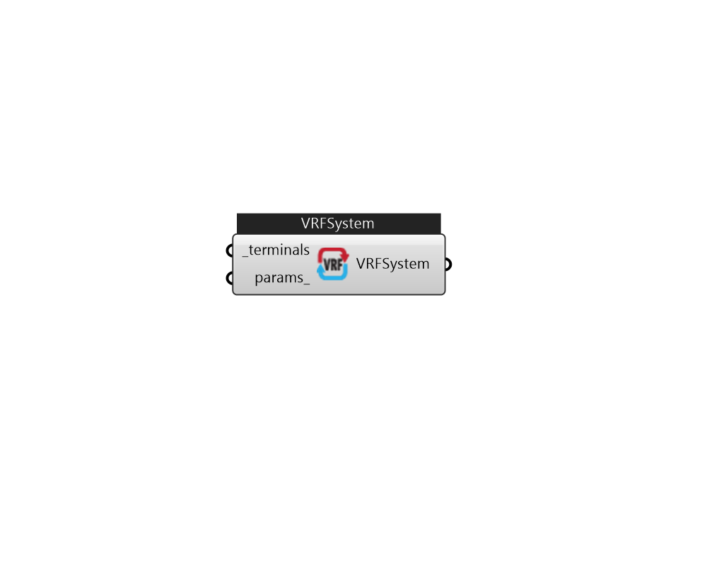

## IB_AirConditionerVariableRefrigerantFlow

There is no documentation available 

#### Inputs
* ##### terminals [Required]
VRF terminals. 
* ##### params 
Detail settings for this HVAC object. Use Ironbug_ObjParams to set input parameters, or use Ironbug_OutputParams to set output variables. 

#### Outputs
* ##### VRFSystem
VRFSystem 