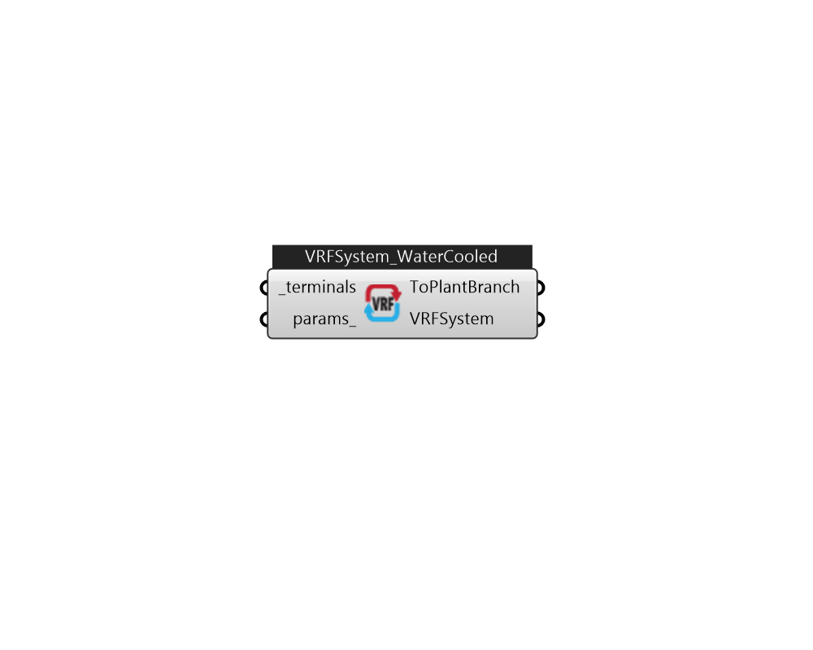

## IB_AirConditionerVariableRefrigerantFlow_WaterCooled

There is no documentation available 

#### Inputs
* ##### terminals [Required]
VRF terminals. 
* ##### params 
Detail settings for this HVAC object. Use Ironbug_ObjParams to set input parameters, or use Ironbug_OutputParams to set output variables. 

#### Outputs
* ##### ToPlantBranch
Connect to condenser plant loop's demand branch 
* ##### VRFSystem
Connect to HVACSystem's VRFSystem input 