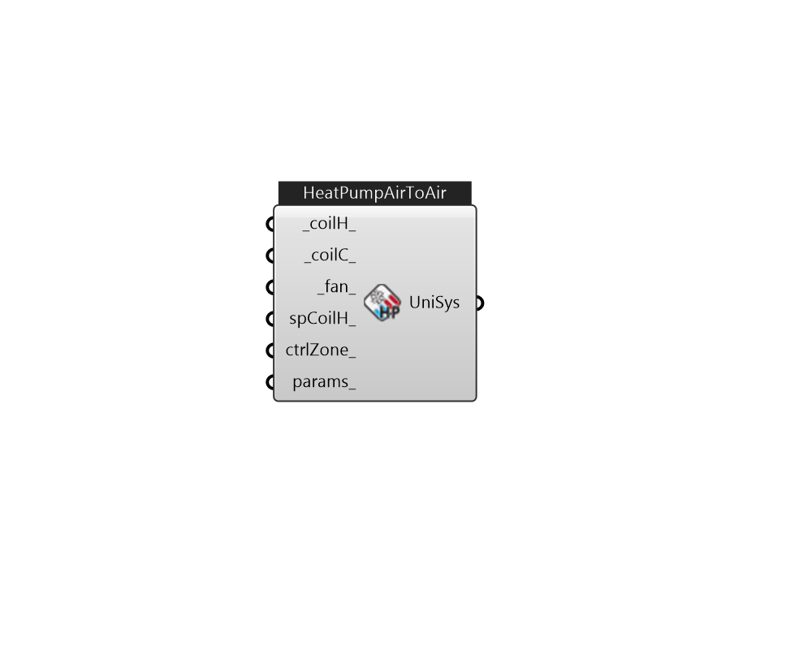

## IB_AirLoopHVACUnitaryHeatPumpAirToAir

The unitary air-to-air heat pump is a ``virtual'' component that consists of a fan component (OnOff or ConstantVolume), a DX cooling coil component, a DX heating coil component, and a Gas or Electric supplementary heating coil component as shown in the Figure below. Links to the fan, DX cooling coil, DX heating coil, and supplementary heating coil specifications are provided in the heat pump's input data syntax. In addition the control zone name and the system design operating conditions are specified by the heat pump inputs.  Above content copyright © 1996-2025 EnergyPlus, all contributors. All rights reserved. EnergyPlus is a trademark of the US Department of Energy. 

#### Inputs
* ##### coilH 
This alpha field contains the identifying name given to the heat pump DX heating coil, and should match the name specified in the corresponding DX heating coil object.   This alpha field contains the identifying type of heating coil specified in the heat pump. Heating coil type must be either {Coil:Heating:DX:SingleSpeed} or {Coil:Heating:DX:VariableSpeed}. 
* ##### coilC 
This alpha field contains the identifying name given to the heat pump cooling coil, and should match the name specified in the corresponding DX cooling coil object.   This alpha field contains the identifying type of cooling coil specified in the heat pump. There are three valid choices for this field: {Coil:Cooling:DX:SingleSpeed} {CoilSystem:Cooling:DX:HeatExchangerAssisted} {Coil:Cooling:DX:VariableSpeed} 
* ##### fan 
This alpha field contains the identifying name given to the heat pump supply air fan, and should match the name specified in the corresponding fan object.   This alpha field contains the identifying type of supply air fan specified for the heat pump. Fan type must be {{Fan:OnOff}} or {{Fan:ConstantVolume}}. {Fan:ConstantVolume} is used when the Supply Air Fan Operating Mode Schedule values are never 0 and the fan operates continuously. {Fan:OnOff} is used when the fan cycles on and off with the cooling or heating coil (i.e.Supply Air Fan Operating Mode Schedule values are at times 0). 
* ##### spCoilH 
This alpha field contains the identifying name given to the heat pump supplemental heating coil, and should match the name specified in the corresponding heating coil object.   This alpha field contains the identifying type of supplemental heating coil specified in the heat pump. The hot water and steam heating coils require specifying plant loop, branches, and connector objects to support the heating coils, and are placed on the demand side of the plantloop. The hot water flow modulation through the supplemental heating coil does not require additional controller or {Controller:WaterCoil} object. The parent object (Airloop Air to Air Heat Pump) itself provides the ``controller'' function of modulating water flow. Heating coil type must be: {Coil:Heating:Electric} {Coil:Heating:Fuel} {Coil:Heating:Water} {Coil:Heating:Steam} 
* ##### ctrlZone 
The controlling zone for thermostat location. It is required to set a valid when the unitary system is used within an air loop. 
* ##### params 
Detail settings for this HVAC object. Use Ironbug_ObjParams to set input parameters, or use Ironbug_OutputParams to set output variables. 

#### Outputs
* ##### UniSys
Connect to airloop's supply side 