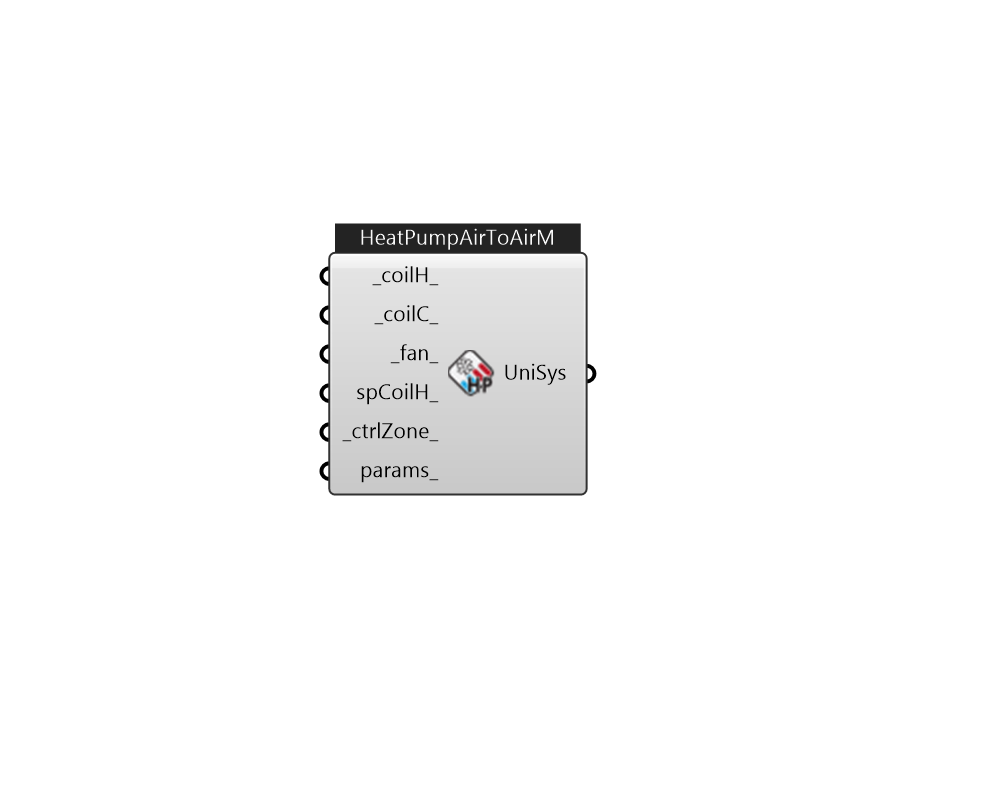

## IB_AirLoopHVACUnitaryHeatPumpAirToAirMultiSpeed

The multispeed air-to-air heat pump is a ``virtual'' component that consists of a fan component (On/Off or ConstVolume), a DX multispeed cooling coil component, a DX multispeed heating coil component, and a Gas or Electric supplemental heating coil component. This system also includes the option to use available waste energy to heat water. A schematic diagram of the air-to-air multispeed heat pump is shown below. The component connection sequence for the blow through option (shown below) from inlet to outlet is fan, cooling coil, heating coil, and supplemental heater. The connection sequence for the draw through option is cooling coil, heating coil, fan, and supplemental heater. The main difference between this heat pump object and other EnergyPlus heat pump objects is that this object allows from two to four discrete compressor speeds for heating and cooling operation (instead of a single speed for each mode). The lowest speed is called Speed 1, and the highest speed is called Speed .... (Due to the length of content, documentation has been shown partially)  Above content copyright © 1996-2025 EnergyPlus, all contributors. All rights reserved. EnergyPlus is a trademark of the US Department of Energy. 

#### Inputs
* ##### coilH 
This alpha field contains the identifying name given to the DX heating coil, and should match the name specified in the corresponding DX heating coil object.   This alpha field contains the identifying type of heating coil specified in the heat pump. Allowable choices for Heating coil type are {{Coil:Heating:DX:MultiSpeed}}, {{Coil:Heating:Electric:MultiStage}}, {{Coil:Heating:Gas:MultiStage}}, {{Coil:Heating:Water}}, and {{Coil:Heating:Steam}}. 
* ##### coilC 
This alpha field contains the identifying name given to the heat pump cooling coil, and should match the name specified in the corresponding DX cooling coil object.   This alpha field contains the identifying type of cooling coil specified in the heat pump. Cooling coil type must be {Coil:Cooling:DX:MultiSpeed}. 
* ##### fan 
This alpha field contains the identifying name given to the heat pump supply air fan, and should match the name specified in the corresponding fan object.   This alpha field contains the identifying type of supply air fan specified for the heat pump. Fan type must be {Fan:OnOff} or {Fan:ConstantVolume}. {Fan:ConstantVolume} can only be used when the supply air fan operating mode is continuous (see field `Supply air fan operating mode schedule name). 
* ##### spCoilH 
This alpha field contains the identifying name given to the heat pump supplemental heating coil, and should match the name specified in the corresponding heating coil object.   This alpha field contains the identifying type of supplemental heating coil specified in the heat pump. The hot water and steam heating coils require specifying plant loop, branches, and connectors objects to support the heating coils, and are placed on the demand side of the plantloop. The hot water flow modulation through the supplemental heating coil does not require additional controller or {Controller:WaterCoil} object. The parent object (Unitary MultiSpeed Air to Air Heat Pump) itself provides the ``controller'' function of modulating water flow. Heating coil type must be: {Coil:Heating:Electric} {Coil:Heating:Fuel} {Coil:Heating:Water} {Coil:Heating:Steam} 
* ##### ctrlZone 
The controlling zone for thermostat location. It is required to set a valid when the unitary system is used within an air loop. 
* ##### params 
Detail settings for this HVAC object. Use Ironbug_ObjParams to set input parameters, or use Ironbug_OutputParams to set output variables. 

#### Outputs
* ##### UniSys
Connect to airloop's supply side 