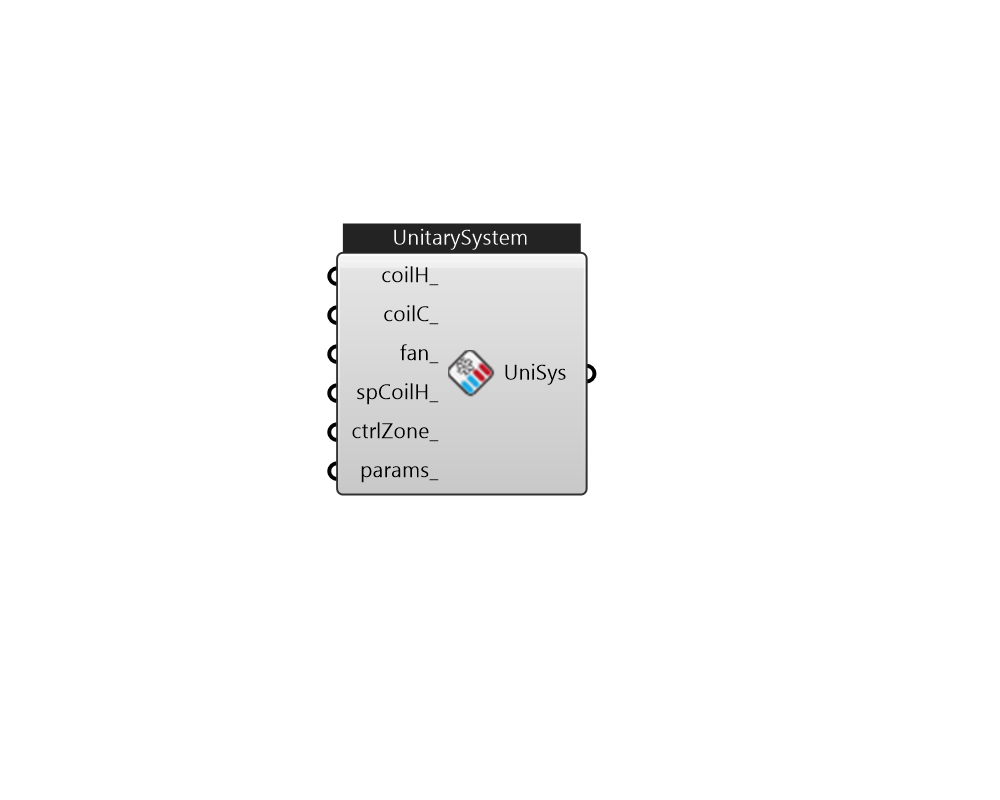

## IB_AirLoopHVACUnitarySystem

The AirloopHVAC:UnitarySystem object is intended to replace all other air loop equipment, although other system types are still available. This system is unique in that it can accommodate all fan and coil types whereas other system types are specific to the type of fan and coil available for simulation. Additionally, although the AirloopHVAC:UnitarySystem is intended for use in the primary airloop, this object can be modeled as zone equipment (i.e., listed in a {ZoneHVAC:EquipmentList}) or as an outside air system component (i.e., listed in a {AirLoopHVAC:OutdoorAirSystem:EquipmentList}). Water coil controllers are not required when these coil types are used with the AirloopHVAC:UnitarySystem object (i.e., leave the controller list name blank in the AirLoopHVAC object if water coils are used exclusively within the Unitary System). The AirLoopHVAC:UnitarySystem object is a ``virtual'' component that consists of a fan component (OnOff, ConstantVolume, VariableVolume, or ComponentModel),.... (Due to the length of content, documentation has been shown partially)  Above content copyright © 1996-2025 EnergyPlus, all contributors. All rights reserved. EnergyPlus is a trademark of the US Department of Energy. 

#### Inputs
* ##### coilH 
Heating coil to provide heating source. By default, no heating coil is included. 
* ##### coilC 
Cooling coil to provide cooling source. By default, no cooling coil is included.  
* ##### fan 
Supply fan. By default, no fan is included. 
* ##### spCoilH 
SupplementalHeatingCoil. By default, no supplemental heating coil is included. 
* ##### ctrlZone 
The controlling zone for thermostat location. It is required to set a valid when the unitary system is used within an air loop. When this unitary system is added as a zone equipment, the default zone is used for the controlling zone if it is unset. 
* ##### params 
Detail settings for this HVAC object. Use Ironbug_ObjParams to set input parameters, or use Ironbug_OutputParams to set output variables. 

#### Outputs
* ##### UniSys
Connect to airloop's supply side 