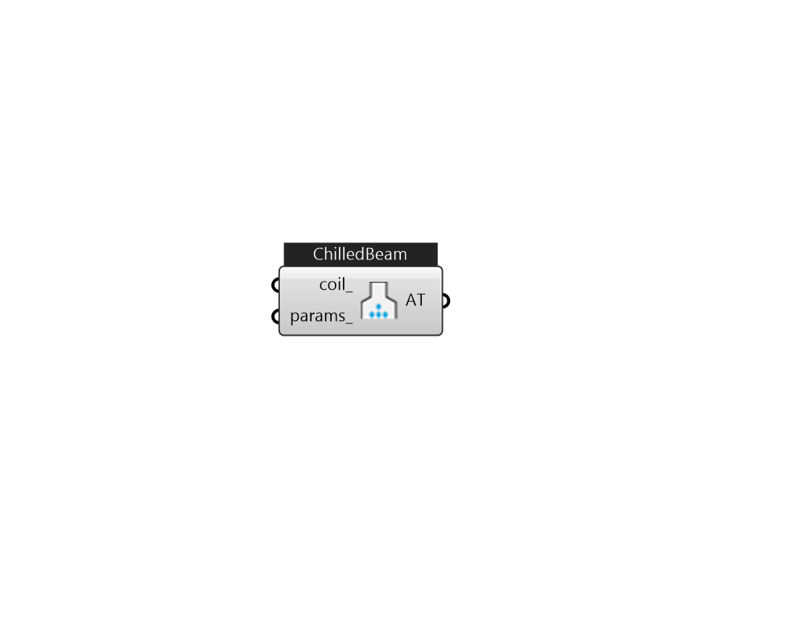

## IB_AirTerminalChilledBeam

The Cooled Beam system is a mixed air-hydronic system. A central, single-duct forced-air system supplies conditioned ventilation air to the zones. Sensible cooling is done by chilled water circulating through ceiling mounted cooled beam units. Chilled water flow rate through the cooled beam units is varied to meet the zone sensible cooling load. Any dehumidification is done by the central ventilation air system. Heating is usually accomplished with hot water radiators. Thermodynamically, the cooled beam system resembles the four-pipe induction unit. To model a typical cooled beam system the user will need to define a conventional central constant volume forced air system. This system will normally be 100% outside air delivered at a fixed supply temperature (which could be reset by schedule or by outside air temperature). On the supply side of this air loop there will be the usual central AC equipment: outside air mixer, fan, heating and cooling coil. On the zone equipment (demand) sid.... (Due to the length of content, documentation has been shown partially)  Above content copyright © 1996-2025 EnergyPlus, all contributors. All rights reserved. EnergyPlus is a trademark of the US Department of Energy. 

#### Inputs
* ##### coil 
CoilCoolingCooledBeam only. 
* ##### params 
Detail settings for this HVAC object. Use Ironbug_ObjParams to set input parameters, or use Ironbug_OutputParams to set output variables. 

#### Outputs
* ##### AT
connect to Zone 