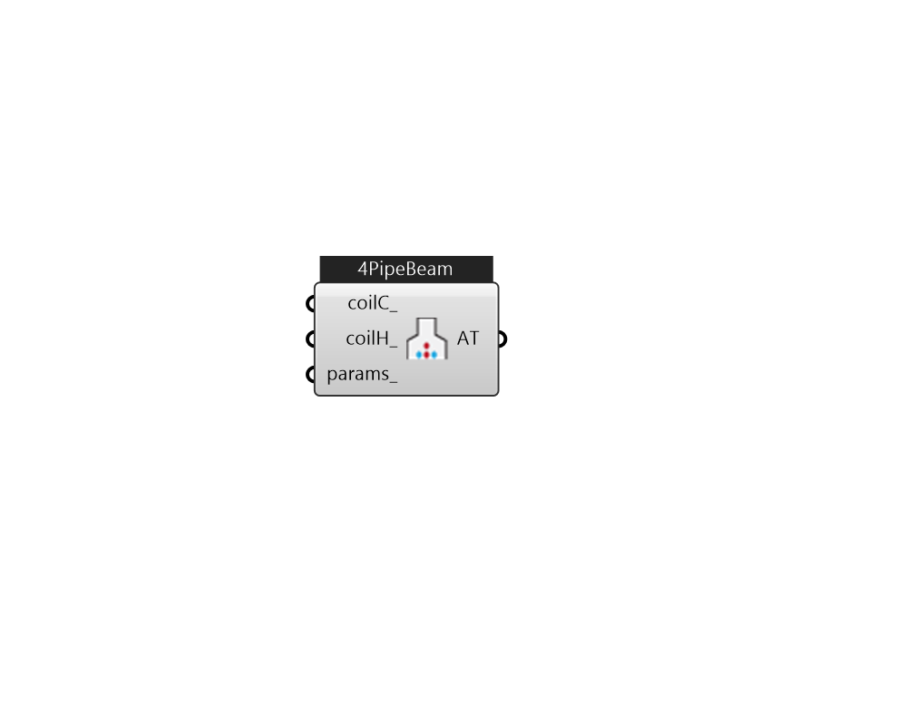

## IB_AirTerminalSingleDuctConstantVolumeFourPipeBeam

The four-pipe beam air terminal system is a mixed air-hydronic system. A central, single-duct forced-air system that supplies conditioned air to the zones. Chilled water circulates through ceiling-mounted fin-tube convector units to provide sensible cooling. Hot water circulates through the same convectors to provide heating. Water flow rate through the beam unit is varied to meet the zone sensible cooling or heating load. Any dehumidification is done by the central forced-air system. Thermodynamically, the cooled beam system resembles the four-pipe induction unit ({{AirTerminal:SingleDuct:ConstantVolume:FourPipeInduction}}). To model a typical four-pipe beam system the user will need to define a conventional central constant volume forced air system in order to deliver primary air to the beam. This central system (usually) provides outside air for ventilation. Primary air is normally delivered at a fixed temperature but could be reset by a schedule or using an outdoor air reset setpo.... (Due to the length of content, documentation has been shown partially)  Above content copyright © 1996-2025 EnergyPlus, all contributors. All rights reserved. EnergyPlus is a trademark of the US Department of Energy. 

#### Inputs
* ##### coilC 
CoilCoolingFourPipeBeam only. 
* ##### coilH 
CoilHeatingFourPipeBeam only. 
* ##### params 
Detail settings for this HVAC object. Use Ironbug_ObjParams to set input parameters, or use Ironbug_OutputParams to set output variables. 

#### Outputs
* ##### AT
connect to Zone 