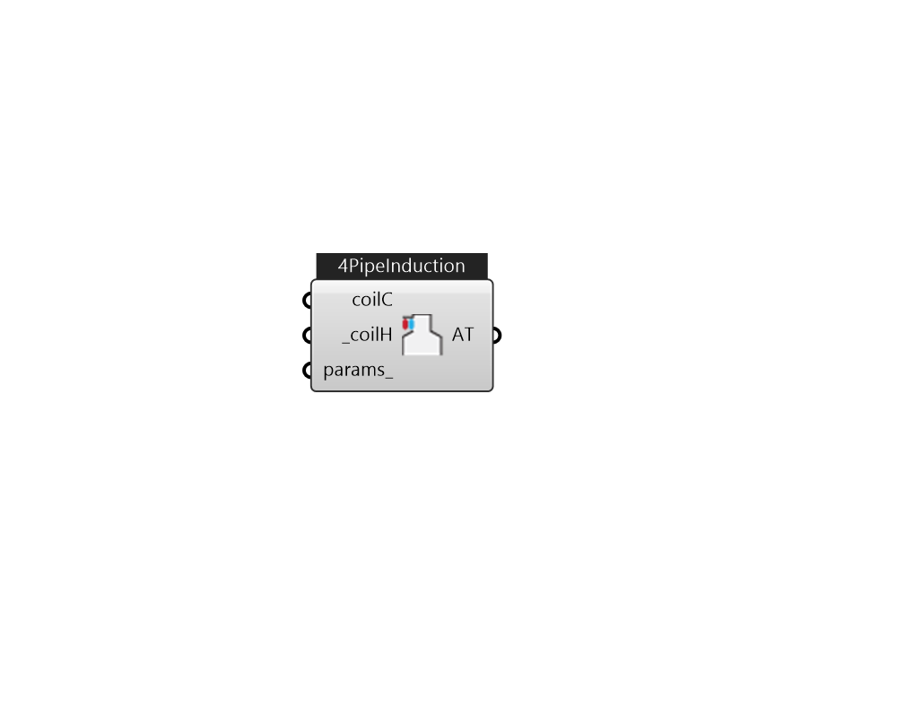

## IB_AirTerminalSingleDuctConstantVolumeFourPipeInduction

The four pipe induction terminal unit provides local hot water heating or chilled water cooling of induced zone air which then mixes with centrally conditioned supply air. An air conditioning system consisting of these terminal units is effectively a mixed central air / local hydronic system. The centrally conditioned air supplied to the induction terminal units is constant volume at quite high pressure. The central air is discharged through a nozzle in the terminal unit, inducing a flow of room air over a hydronic heating/cooling coil. The coil is connected either to a single inlet and outlet pipe (2 pipe unit) or to 2 inlets and 2 outlets (4 pipe unit). The heated or cooled induced air mixes with the centrally conditioned air before being discharged into the zone. The terminal units are usually expected to do only sensible cooling – any dehumidification is done by the central air conditioning system. The EnergyPlus model of the four pipe induction terminal unit is a compound compone.... (Due to the length of content, documentation has been shown partially)  Above content copyright © 1996-2025 EnergyPlus, all contributors. All rights reserved. EnergyPlus is a trademark of the US Department of Energy. 

#### Inputs
* ##### coilC 
Optional input, but use CoilCoolingWater only. By default, this 4PipeInduction will become a heating only 2PipeInduction, if its cooling coil is left empty. 
* ##### coilH [Required]
CoilHeatingWater only. 
* ##### params 
Detail settings for this HVAC object. Use Ironbug_ObjParams to set input parameters, or use Ironbug_OutputParams to set output variables. 

#### Outputs
* ##### AT
connect to Zone 