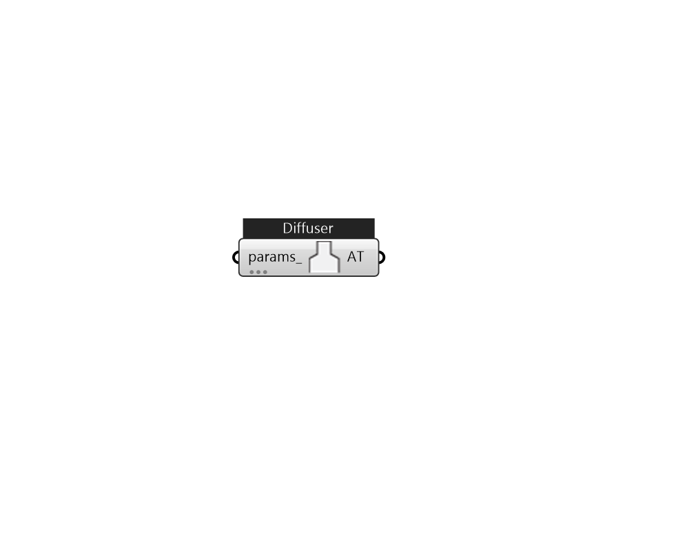

## IB_AirTerminalSingleDuctConstantVolumeNoReheat

The AirTerminal:SingleDuct:ConstantVolume:NoReheat object creates the capability of supplying central system air directly to a zone without any zone level thermostat control. The supply air temperature is controlled by the central system controller. It is typically used with a unitary system and furnaces which controls the system supply temperature and flow rate with continuous or cycling fan. When used without the Design Specification Outdoor Air Object Name, the terminal unit is passive and accepts any flow rate supplied by the central system, but will never exceed the maximum air flow rate. This object allows the program to know what zone this branch of the air system is attached to, and input fields for availability schedule, air inlet and outlet nodes, the maximum air flow rate, and other two optional input fields. The air inlet node should be the same as one of the {{AirLoopHVAC:ZoneSplitter}} or {{AirLoopHVAC:SupplyPlenum}} component  outlet nodes. The air outlet node name shou.... (Due to the length of content, documentation has been shown partially)  Above content copyright © 1996-2025 EnergyPlus, all contributors. All rights reserved. EnergyPlus is a trademark of the US Department of Energy. 

#### Inputs
* ##### params 
Detail settings for this HVAC object. Use Ironbug_ObjParams to set input parameters, or use Ironbug_OutputParams to set output variables. 

#### Outputs
* ##### AT
connect to Zone 