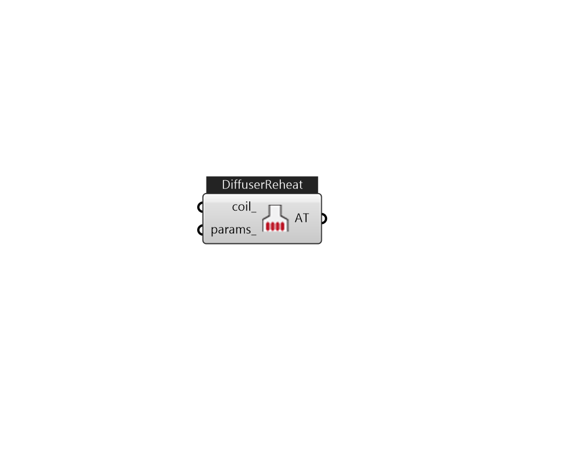

## IB_AirTerminalSingleDuctConstantVolumeReheat

The AirTerminal:SingleDuct:ConstantVolume:Reheat or terminal reheat system is a constant volume reheat system. The systems cooling capabilities are provided by way of cooling coil that supplies cooling to the entire supply air volume. The cooling coil is controlled by a controller setpoint specified for the cooling coil. Zone control is accomplished by heating (reheating) the airflow into each zone as determined by the zone thermostat. Currently the reheat can be supplied by a electric, gas, or hot water coil that tries to meet the zone demand.  Above content copyright © 1996-2025 EnergyPlus, all contributors. All rights reserved. EnergyPlus is a trademark of the US Department of Energy. 

#### Inputs
* ##### coil 
Heating coil to provide reheat source. can be CoilHeatingWater, CoilHeatingElectirc, or CoilHeatingGas. 
* ##### params 
Detail settings for this HVAC object. Use Ironbug_ObjParams to set input parameters, or use Ironbug_OutputParams to set output variables. 

#### Outputs
* ##### AT
connect to Zone 