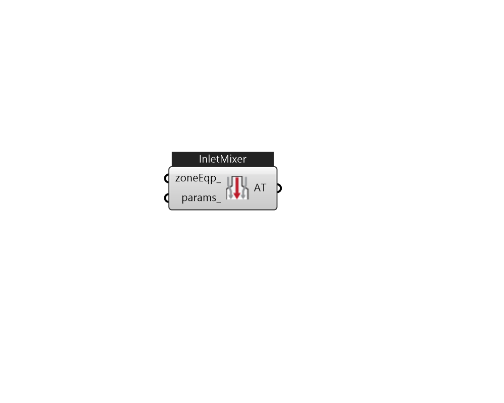

## IB_AirTerminalSingleDuctInletSideMixer

There is no component description available now!  Please stay tuned or contribute :>  Source code: https://github.com/MingboPeng/Ironbug 

#### Inputs
* ##### zoneEqp 
ZoneEquipment that mixes its air with this air terminal supply air at its inlet side. This ZoneEquipment has to be also plugged in ThermalZone's ZoneEquipment list input. 
* ##### params 
Detail settings for this HVAC object. Use Ironbug_ObjParams to set input parameters, or use Ironbug_OutputParams to set output variables. 

#### Outputs
* ##### AT
connect to Zone 