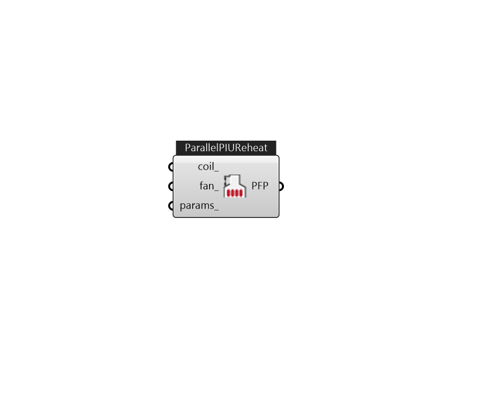

## IB_AirTerminalSingleDuctParallelPIUReheat

The parallel powered induction unit is an air system terminal unit that mixes varying amounts of secondary (recirculated) air and primary (conditioned supply) air to produce a variable total flow of air to a zone. The unit contains a small fan that acts to induce the secondary air and a heating coil for heating the mixed secondary and primary air. The secondary and primary air streams enter the unit in parallel. The fan sits in the secondary air stream and runs only when the primary air flow is below the Fan On Flow Fraction and the fan's availability schedule is on or it is activated by an availability manager. The primary air inlet contains a damper that can move from fully open (maximum primary air) to a minimum stop (minimum primary air). At full cooling load the primary air damper is fully open and the fan is off. The primary air flow is at maximum and there is little or no secondary air flow. As the cooling load decreases, the primary air damper gradually closes and the secondar.... (Due to the length of content, documentation has been shown partially)  Above content copyright © 1996-2025 EnergyPlus, all contributors. All rights reserved. EnergyPlus is a trademark of the US Department of Energy. 

#### Inputs
* ##### coil 
Heating coil to provide reheat source. can be CoilHeatingWater, CoilHeatingElectirc, or CoilHeatingGas. 
* ##### fan 
FanConstantVolume. 
* ##### params 
Detail settings for this HVAC object. Use Ironbug_ObjParams to set input parameters, or use Ironbug_OutputParams to set output variables. 

#### Outputs
* ##### PFP
TODO:... 