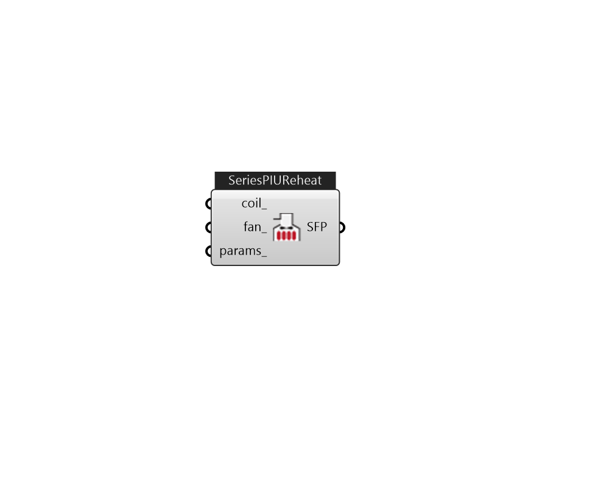

## IB_AirTerminalSingleDuctSeriesPIUReheat

The series powered induction unit is an air system terminal unit that mixes varying amounts of secondary (recirculated) air and primary (conditioned supply) air to produce a fixed flow of air to a zone. The unit contains a small fan that acts to induce the secondary air and a heating coil for heating the mixed secondary and primary air. The fan runs at a constant volume flow rate whenever the unit is on (and the fan's availability schedule is on or it is activated by an availability manager). The fan is downstream of the primary and secondary air inlets. The variable mixing is accomplished by a damper in the unit's primary air supply inlet duct. This damper can move from fully open (100% primary air. 0% secondary air) to a minimum stop that is specified in the input description. At full cooling the damper will be fully open. At minimum cooling and for heating the damper will be at the minimum stop and the secondary air flow will be at its maximum. During night cycle operation, if the a.... (Due to the length of content, documentation has been shown partially)  Above content copyright © 1996-2025 EnergyPlus, all contributors. All rights reserved. EnergyPlus is a trademark of the US Department of Energy. 

#### Inputs
* ##### coil 
Heating coil to provide reheat source. can be CoilHeatingWater, CoilHeatingElectirc, or CoilHeatingGas. 
* ##### fan 
FanConstantVolume. 
* ##### params 
Detail settings for this HVAC object. Use Ironbug_ObjParams to set input parameters, or use Ironbug_OutputParams to set output variables. 

#### Outputs
* ##### SFP
TODO:... 