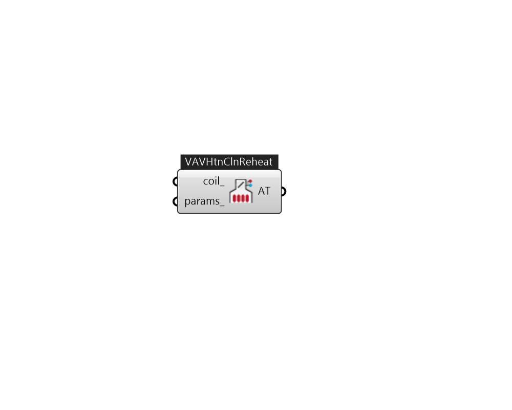

## IB_AirTerminalSingleDuctVAVHeatAndCoolReheat

Variable air volume (VAV) systems typically control the dry-bulb temperature inside a zone by varying the supply air volume instead of the supply air temperature (ref: {AirTerminal:SingleDuct:VAV:NoReheat}). Reheat coils may be required to avoid overcooling (ref: {AirTerminal:SingleDuct:VAV:Reheat}). This terminal unit is slightly different from the {AirTerminal:SingleDuct:VAV:Reheat} terminal unit. Both operate the same in cooling mode: the damper opens as needed to provide additional sensible cooling to the zone. The difference between the two is in heating mode. For the Single Duct VAV Reheat terminal unit, the air flow rate is reduced to the minimum value (max air flow rate x zone minimum air flow fraction) when zone heating is required and the reheat coil output is modulated to meet the zone heating load. The zone minimum supply air flow can be further adjusted using scheduled fraction values specified in the field {Minimum Air Flow Turndown Schedule Name}. For the AirTerminal:Si.... (Due to the length of content, documentation has been shown partially)  Above content copyright © 1996-2025 EnergyPlus, all contributors. All rights reserved. EnergyPlus is a trademark of the US Department of Energy. 

#### Inputs
* ##### coil 
Heating coil to provide reheat source. can be CoilHeatingWater, CoilHeatingElectirc, or CoilHeatingGas. 
* ##### params 
Detail settings for this HVAC object. Use Ironbug_ObjParams to set input parameters, or use Ironbug_OutputParams to set output variables. 

#### Outputs
* ##### AT
connect to Zone 