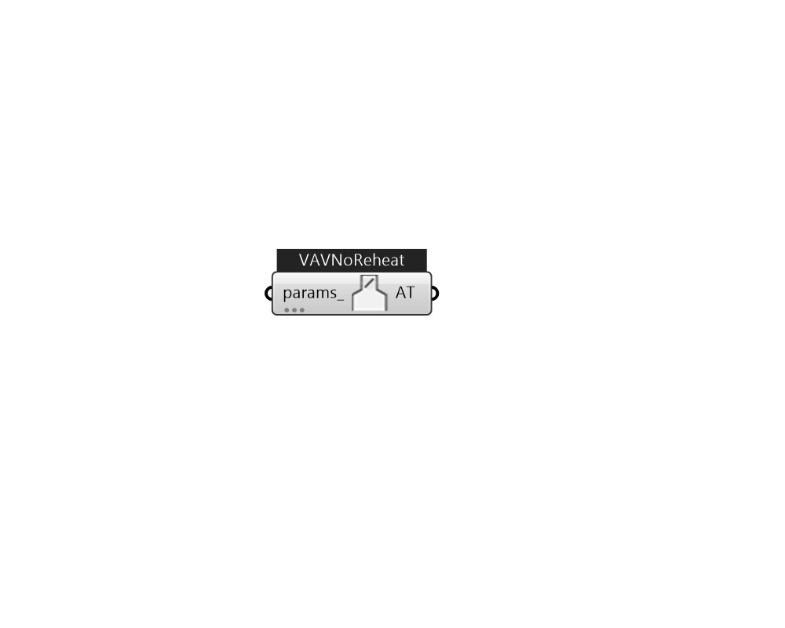

## IB_AirTerminalSingleDuctVAVNoReheat

Variable air volume (VAV) systems control the dry-bulb temperature inside a zone by varying the supply air volume instead of the air temperature. At full cooling the VAV damper is fully open supplying the specified maximum air flow rate. As the cooling load decreases, the damper closes until it reaches the minimum stop specified by the zone minimum air flow fraction. The zone minimum supply air flow can be adjusted using scheduled fraction values specified in the field {Minimum Air Flow Turndown Schedule Name}. VAV systems can be used for interior or perimeter zones with a common fan system and air temperature control. The VAV concept may vary according to the VAV box locations and air temperature controls. Heating can be provided if necessary by use of baseboard.  Above content copyright © 1996-2025 EnergyPlus, all contributors. All rights reserved. EnergyPlus is a trademark of the US Department of Energy. 

#### Inputs
* ##### params 
Detail settings for this HVAC object. Use Ironbug_ObjParams to set input parameters, or use Ironbug_OutputParams to set output variables. 

#### Outputs
* ##### AT
connect to Zone 