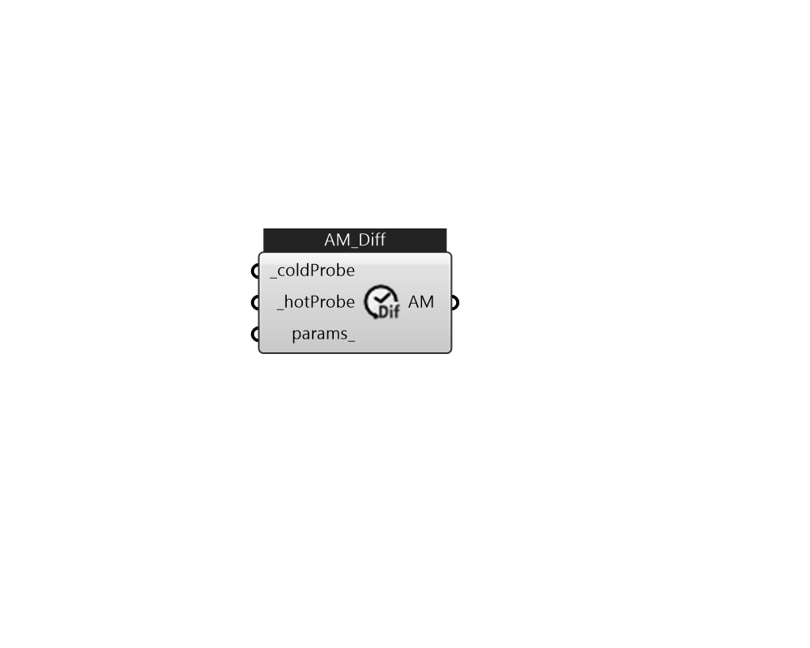

## IB_AvailabilityManagerDifferentialThermostat

There is no component description available now!  Please stay tuned or contribute :>  Source code: https://github.com/MingboPeng/Ironbug 

#### Inputs
* ##### coldProbe [Required]
Add a IB_NodeProbe (cold) to a loop first, and then connect the probe to here for availability manager to use. 
* ##### hotProbe [Required]
Add a IB_NodeProbe (hot) to a loop first, and then connect the probe to here for availability manager to use. 
* ##### params 
Detail settings for this HVAC object. Use Ironbug_ObjParams to set input parameters, or use Ironbug_OutputParams to set output variables. 

#### Outputs
* ##### AM
TODO.. 