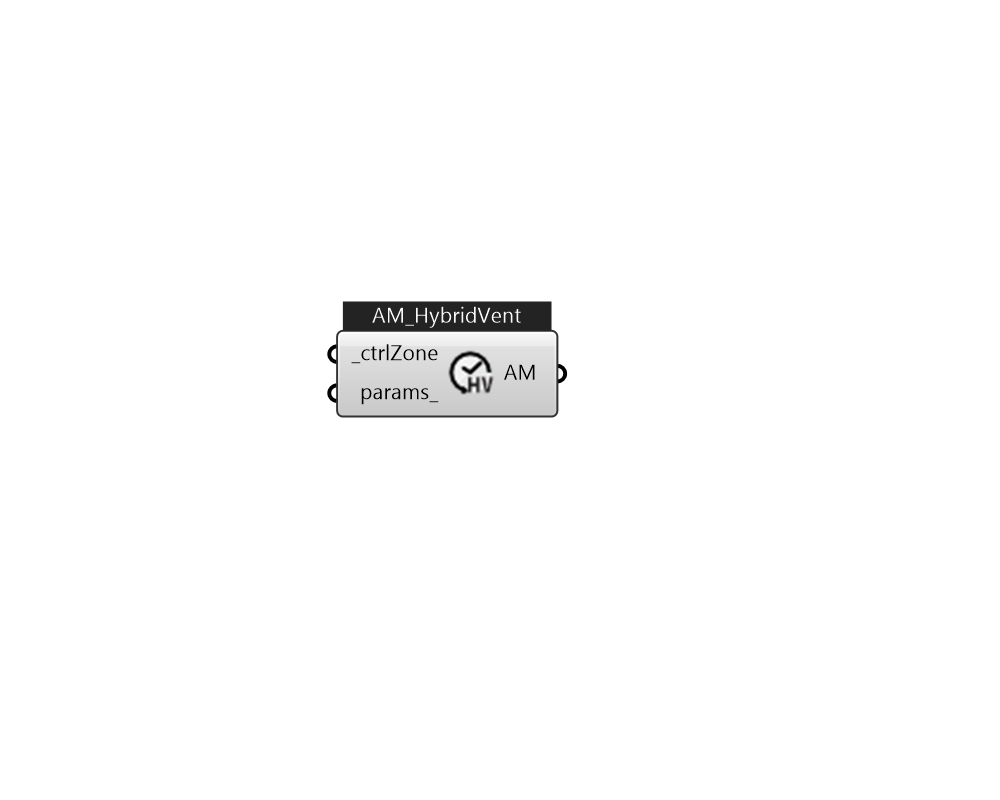

## IB_AvailabilityManagerHybridVentilation

There is no component description available now!  Please stay tuned or contribute :>  Source code: https://github.com/MingboPeng/Ironbug 

#### Inputs
* ##### ctrlZone [Required]
A controlled zone served by the air loop defined. The air conditions in this zone are used to determine if natural ventilation should be provided. 
* ##### params 
Detail settings for this HVAC object. Use Ironbug_ObjParams to set input parameters, or use Ironbug_OutputParams to set output variables. 

#### Outputs
* ##### AM
TODO.. 