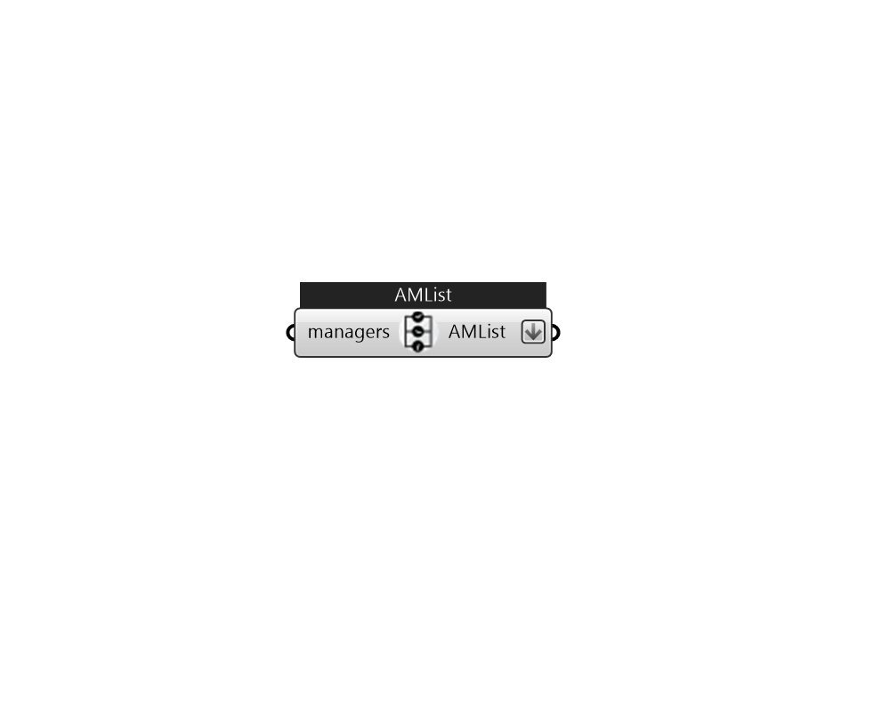

## IB_AvailabilityManagerList

Use AvailabilityManagerList if you have more than one availability managers (from highest precedence to lowest) for one loop 

#### Inputs
* ##### managers 
A list of availability managers (from highest precedence to lowest) that will be grouped. 

#### Outputs
* ##### AMList
A list of availability managers that will be added to each loop. Connect to loop's AvailabilityManager 