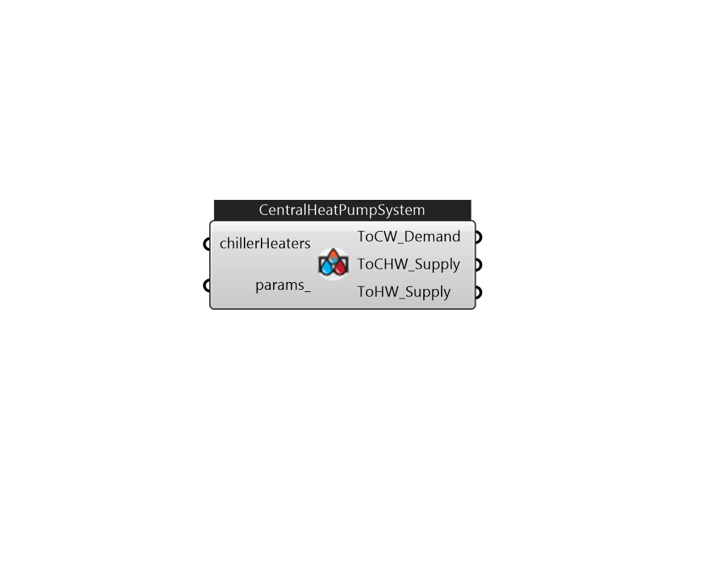

## IB_CentralHeatPumpSystem

This is a central geothermal application that contains one or more chiller-heaters centrally located in the building; the available chilled and/or hot water is then piped to the individual zones. Chiller-heaters used for this particular system can be of two types: 1) standard vapor-compression, non-reversible cycle chillers designed for heat recovery or 2) reversible-cycle, water-to-water heat pump chillers. Unlike a distributed ground source heat pump configuration where individual heat pumps are located in each zone, a centralized geothermal configuration has one or more chiller-heaters. Its function is to encapsulate the extra controls needed to turn individual chiller-heater modules on/off and whether they are to operate in cooling-only, heating-only or simultaneous cooling-heating mode and whether to connect the source water to the evaporator or condenser side. A variety of control schemes can be designed by setting schedules for both zone control types and individual chiller-heat.... (Due to the length of content, documentation has been shown partially)  Above content copyright © 1996-2025 EnergyPlus, all contributors. All rights reserved. EnergyPlus is a trademark of the US Department of Energy. 

#### Inputs
* ##### chillerHeaters 
use ChillerHeaterPerformanceElectricEIR or CentralHeatPumpSystemModules. Typically three chillerheaters are needed 
* ##### params 
Detail settings for this HVAC object. Use Ironbug_ObjParams to set input parameters, or use Ironbug_OutputParams to set output variables. 

#### Outputs
* ##### ToCW_Demand
connect to condenser water plantloop's demand side 
* ##### ToCHW_Supply
connect to chilled water plantloop's supply side 
* ##### ToHW_Supply
connect to hot water plantloop's supply side 