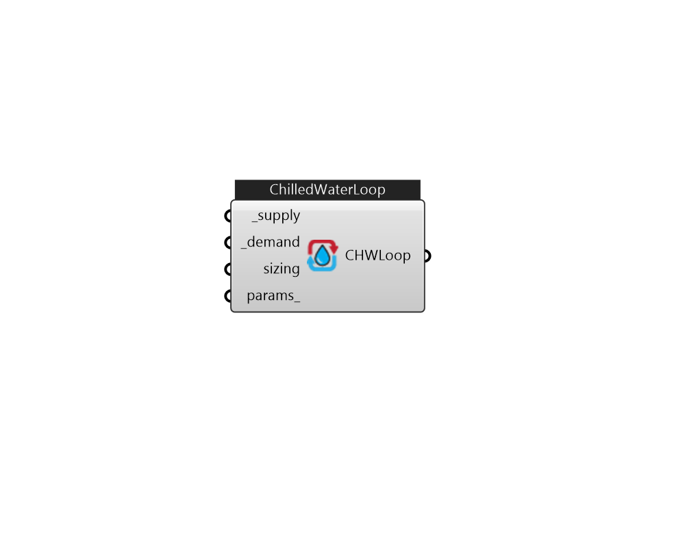

## IB_ChilledWaterPlantLoop

Same as PlantLoop, except the FluidType and LoopType cannot be overridden. 

#### Inputs
* ##### supply [Required]
HVAC components 
* ##### demand [Required]
HVAC components 
* ##### sizing 
HVAC components 
* ##### params 
Detail settings for this HVAC object. Use Ironbug_ObjParams to set input parameters, or use Ironbug_OutputParams to set output variables. 

#### Outputs
* ##### CHWLoop
ChilledWaterPlantLoop 