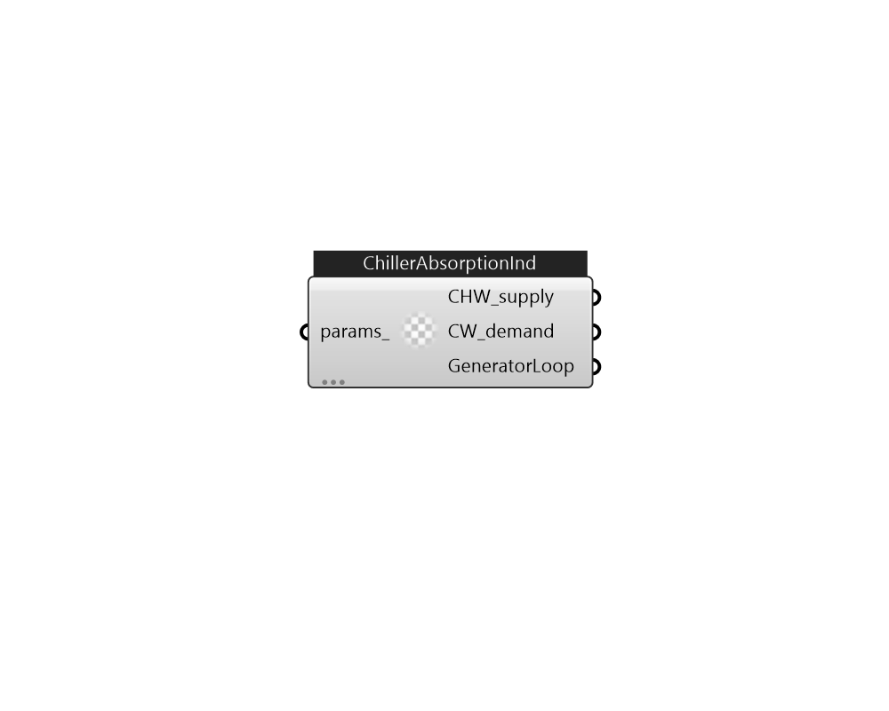

## IB_ChillerAbsorptionIndirect

The Chiller:Absorption:Indirect object is an enhanced version of the absorption chiller model found in the Building Loads and System Thermodynamics (BLAST) program. This enhanced model is nearly identical to the existing absorption chiller model (Ref. {Chiller:Absorption}) with the exceptions that: 1) the enhanced indirect absorption chiller model provides more flexible performance curves and 2) chiller performance now includes the impact of varying evaporator, condenser, and generator temperatures. Since these absorption chiller models are nearly identical (i.e., the performance curves of the enhanced model can be manipulated to produce similar results to the previous model), it is quite probable that the {Chiller:Absorption} model will be deprecated in a future release of EnergyPlus.  Above content copyright © 1996-2025 EnergyPlus, all contributors. All rights reserved. EnergyPlus is a trademark of the US Department of Energy. 

#### Inputs
* ##### params 
Detail settings for this HVAC object. Use Ironbug_ObjParams to set input parameters, or use Ironbug_OutputParams to set output variables. 

#### Outputs
* ##### CHW_supply
connect to chilled water loop's supply side 
* ##### CW_demand
connect to condenser water loop's supply side 
* ##### GeneratorLoop
(Optional) connect to a steam or hot water loop's demand side. 