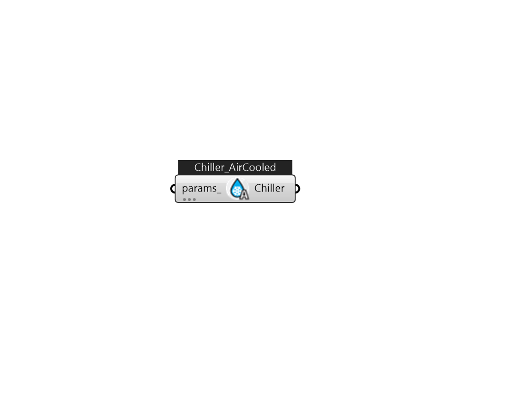

## IB_ChillerElectricEIR_AirCooled

This chiller model is the empirical model used in the DOE-2.1 building energy simulation program. The model uses performance information at reference conditions along with three curve fits for cooling capacity and efficiency to determine chiller operation at off-reference conditions. Chiller performance curves can be generated by fitting manufacturer's catalog data or measured data. Performance curves for more than 160 chillers, including the default DOE-2.1E reciprocating and centrifugal chillers, are provided in the EnergyPlus Reference DataSets (Chillers.idf and AllDataSets.idf). Note: Chiller:Electric:EIR objects and their associated performance curve objects are developed using performance information for a specific chiller and should normally be used together for an EnergyPlus simulation. Changing the object input values, or swapping performance curves between chillers, should be done with caution.  Above content copyright © 1996-2025 EnergyPlus, all contributors. All rights reserved. EnergyPlus is a trademark of the US Department of Energy. 

#### Inputs
* ##### params 
Detail settings for this HVAC object. Use Ironbug_ObjParams to set input parameters, or use Ironbug_OutputParams to set output variables. 

#### Outputs
* ##### Chiller
Connect to chilled water loop's supply side. 