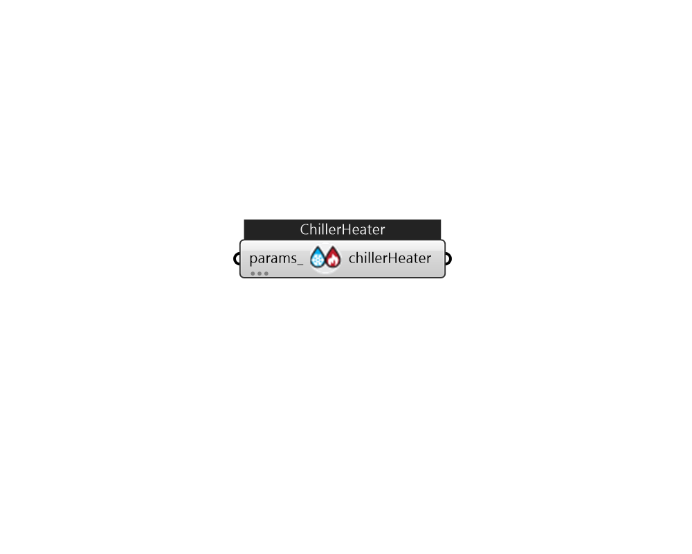

## IB_ChillerHeaterPerformanceElectricEIR

The performance of the chiller-heater will be defined by two sets of curves meant to describe unloading for: 1) cooling-only mode, and 2) heating-only mode or simultaneous cooling-heating mode. Reference conditions must be defined for both because each has its own set of three unloading curves based on their associated reference conditions. The cooling-mode curves are typically (but not always) based on condenser entering water temperature while the heating-only mode curves are typically based on condenser leaving water temperature. This chiller-heater object allows the user to specify whether to use condenser leaving or condenser entering as a dependent variable to differentiate, if necessary, the condenser temperature basis used to generate the cooling- and heating-only mode curves.  Above content copyright © 1996-2025 EnergyPlus, all contributors. All rights reserved. EnergyPlus is a trademark of the US Department of Energy. 

#### Inputs
* ##### params 
Detail settings for this HVAC object. Use Ironbug_ObjParams to set input parameters, or use Ironbug_OutputParams to set output variables. 

#### Outputs
* ##### chillerHeater
connect to CentralHeatPumpSystem 