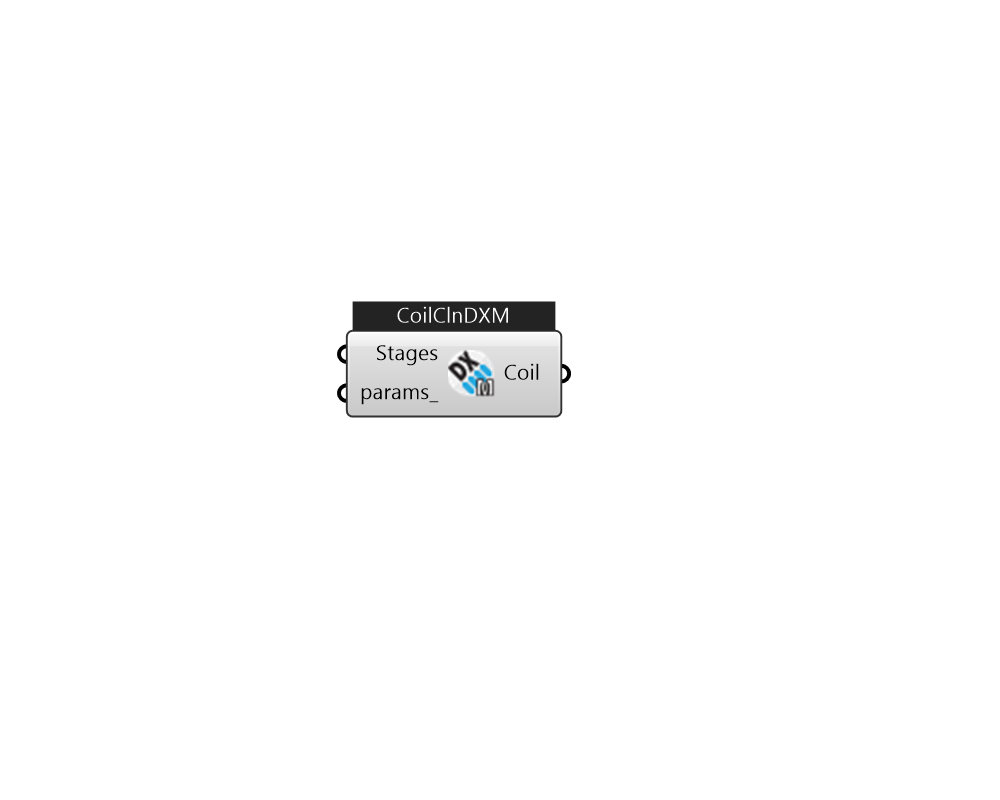

## IB_CoilCoolingDXMultiSpeed

This component models a DX cooling unit with multiple discrete levels of cooling capacity. Depending on input choices, the user can model a single compressor with multiple operating speeds, or a unit with a single cooling coil fed by multiple compressors (e.g., row split or intertwined coil circuiting). Currently, this cooling coil can only be referenced by a {AirLoopHVAC:UnitarySystem} or {AirLoopHVAC:UnitaryHeatPump:AirToAir:Multispeed} object. Refer to {Coil:Cooling:DX:TwoStageWithHumidityControlMode} if the user wishes to model a cooling coil with discrete levels of cooling and the possibility of air bypass during low speed operation (e.g. face-split coil circuiting), or if cooling coil operation based on dehumidification requirements is desired. The multispeed DX cooling coil can have from two to four operating speeds. When the coil operates at Speed 1 (the lowest speed), its performance is very similar to the single speed DX coil where the impacts of part-load ratio and latent c.... (Due to the length of content, documentation has been shown partially)  Above content copyright © 1996-2025 EnergyPlus, all contributors. All rights reserved. EnergyPlus is a trademark of the US Department of Energy. 

#### Inputs
* ##### Stages 
A list of IB_CoilCoolingDXMultiSpeedStageData 
* ##### params 
Detail settings for this HVAC object. Use Ironbug_ObjParams to set input parameters, or use Ironbug_OutputParams to set output variables. 

#### Outputs
* ##### Coil
CoilCoolingDXMultiSpeed 