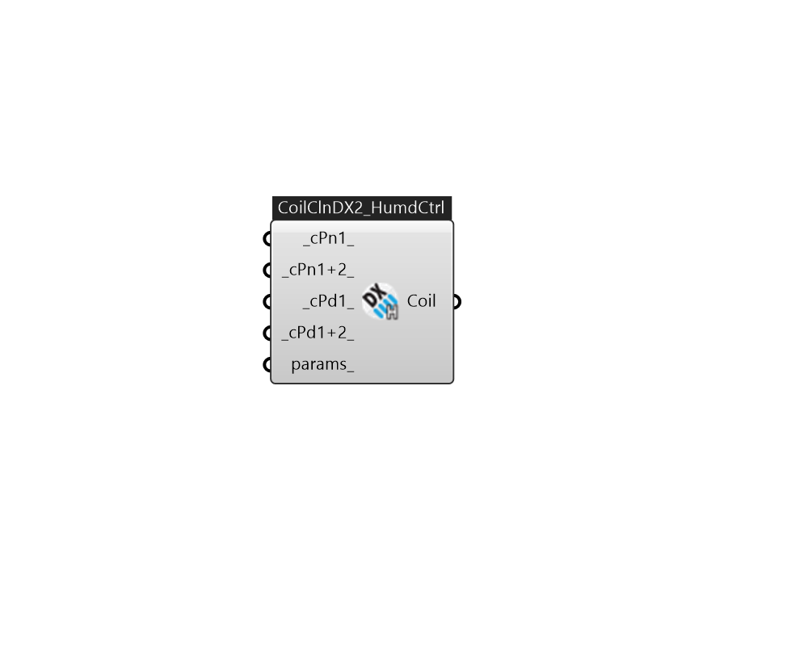

## IB_CoilCoolingDXTwoStageWithHumidityControlMode

The multimode DX coil is functionally equivalent to {Coil:Cooling:DX:SingleSpeed} but with multiple performance modes. It is capable of modeling two-stage DX units and units with an enhanced dehumidification mode such as coil bypass or subcool reheat. This object contains one-time specifications for the DX unit such as node names and crankcase heater specifications. It references one or more {CoilPerformance:DX:Cooling} objects which define the performance for each mode of operation. It can have up to 4 performance modes to accommodate a 2-stage 2-mode unit. The multimode DX coil can be used only as a component of {AirLoopHVAC:UnitarySystem}, {CoilSystem:Cooling:DX} or {AirLoopHVAC:UnitaryHeatCool:VAVChangeoverBypass} (parent object). These parent objects pass a load and dehumidification mode to this coil. If the coil has 2 capacity stages, the multimode coil model determines the stage sequencing.  Above content copyright © 1996-2025 EnergyPlus, all contributors. All rights reserved. EnergyPlus is a trademark of the US Department of Energy. 

#### Inputs
* ##### cPn1 
Coil performance object which specifies the DX coil performance for stage 1 operation without enhanced dehumidification (normal mode). Must be CoilPerformanceDXCooling 
* ##### cPn1+2 
Coil performance object which specifies the DX coil performance for stage 1+2 operation (both stages active) without enhanced dehumidification (normal mode). Must be CoilPerformanceDXCooling 
* ##### cPd1 
Coil performance object which specifies the DX coil performance for stage 1 operation with enhanced dehumidification active. Must be CoilPerformanceDXCooling 
* ##### cPd1+2 
Coil performance object which specifies the DX coil performance for stage 1+2 operation (both stages active) with enhanced dehumidification active. Must be CoilPerformanceDXCooling 
* ##### params 
Detail settings for this HVAC object. Use Ironbug_ObjParams to set input parameters, or use Ironbug_OutputParams to set output variables. 

#### Outputs
* ##### Coil
CoilCoolingDXTwoStageWithHumidityControlMode 