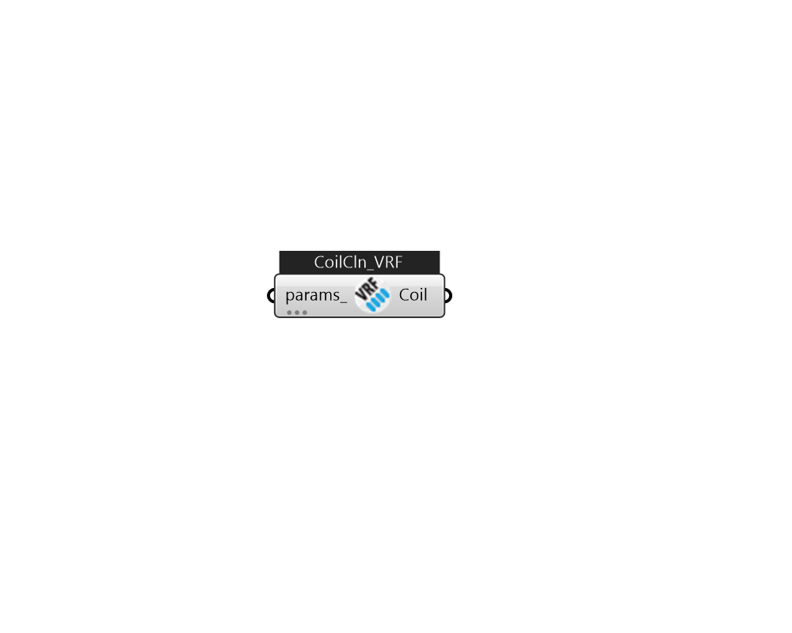

## IB_CoilCoolingDXVariableRefrigerantFlow

The variable refrigerant flow (VRF) DX cooling coil model is nearly identical to the single-speed DX cooling coil model (Ref. {Coil:Cooling:DX:SingleSpeed}). For this reason, an adaptation of the single-speed DX cooling coil model is used to model the variable-speed compression system used in VRF AC systems. The model inputs are quite similar to the input requirements for the single-speed DX cooling coil model, however, the location of a majority of the inputs have been moved to the variable refrigerant flow air conditioner object since multiple DX cooling coils will use the same DX compression system (Ref. {AirConditioner:VariableRefrigerantFlow}).  Above content copyright © 1996-2025 EnergyPlus, all contributors. All rights reserved. EnergyPlus is a trademark of the US Department of Energy. 

#### Inputs
* ##### params 
Detail settings for this HVAC object. Use Ironbug_ObjParams to set input parameters, or use Ironbug_OutputParams to set output variables. 

#### Outputs
* ##### Coil
Connect to Ironbug_ZoneHVACTerminalUnitVariableRefrigerantFlow_Advanced 