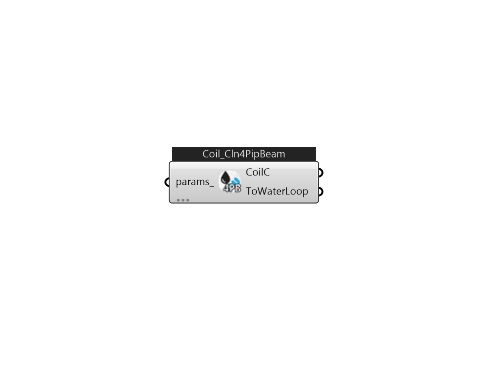

## IB_CoilCoolingFourPipeBeam

There is no component description available now!  Please stay tuned or contribute :>  Source code: https://github.com/MingboPeng/Ironbug 

#### Inputs
* ##### params 
Detail settings for this HVAC object. Use Ironbug_ObjParams to set input parameters, or use Ironbug_OutputParams to set output variables. 

#### Outputs
* ##### CoilC
Connect to chilled beam 
* ##### ToWaterLoop
Connect to chilled water loop's demand side via plantBranches 