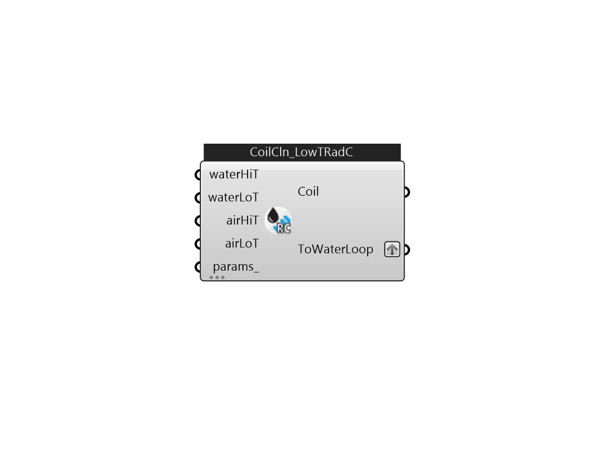

## IB_CoilCoolingLowTempRadiantConstFlow

There is no component description available now!  Please stay tuned or contribute :>  Source code: https://github.com/MingboPeng/Ironbug 

#### Inputs
* ##### waterHiT 
High Water Temperature 
* ##### waterLoT 
Low Water Temperature 
* ##### airHiT 
High Air Temperature 
* ##### airLoT 
Low Air Temperature 
* ##### params 
Detail settings for this HVAC object. Use Ironbug_ObjParams to set input parameters, or use Ironbug_OutputParams to set output variables. 

#### Outputs
* ##### Coil
Add to ZoneHVACLowTempRadiantConstFlow 
* ##### ToWaterLoop
Connect to hot water loop's demand side via plantBranches 