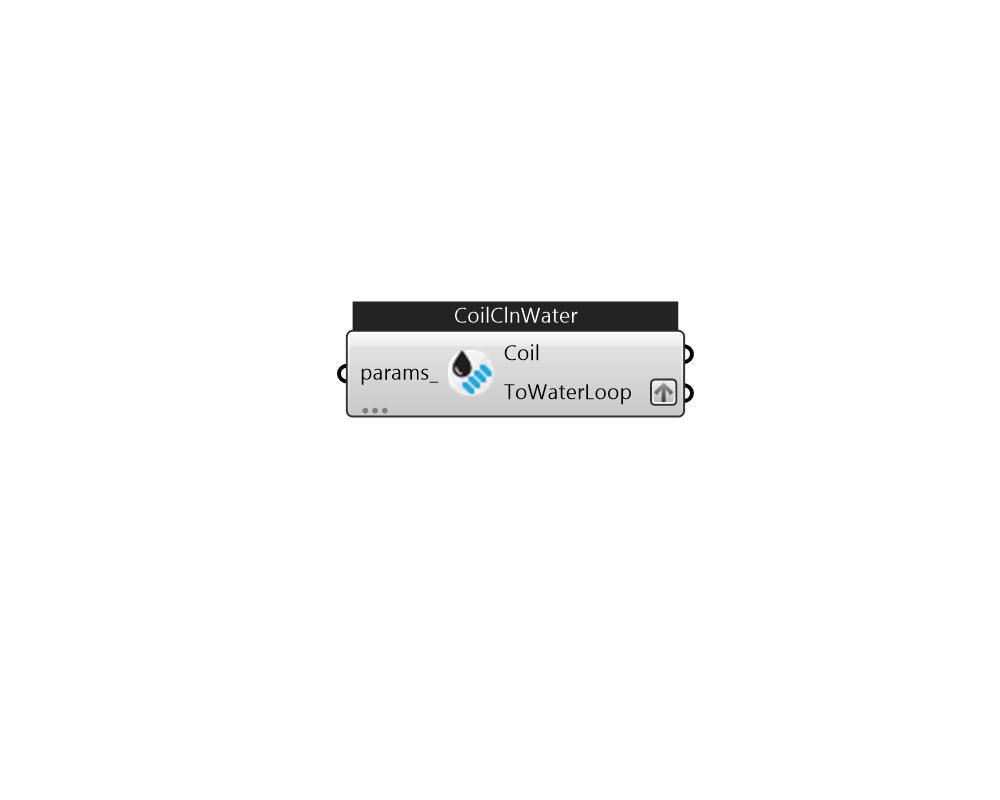

## IB_CoilCoolingWater

 

#### Inputs
* ##### params 
Detail settings for this HVAC object. Use Ironbug_ObjParams to set input parameters, or use Ironbug_OutputParams to set output variables. 

#### Outputs
* ##### Coil
Connect to air loop's supply side or other water cooled system. 
* ##### ToWaterLoop
Connect to chilled water loop's demand side via plantBranches 