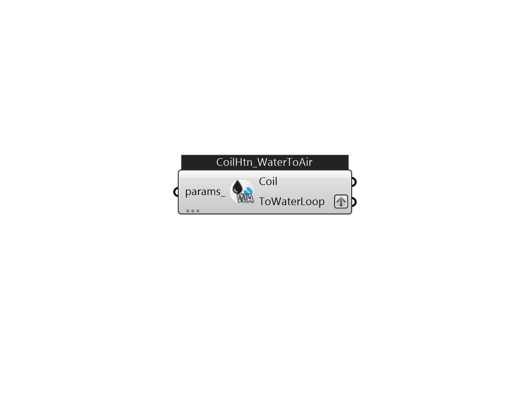

## IB_CoilCoolingWaterToAirHeatPumpEquationFit

The {Coil:Cooling:Water}ToAirHeatPump:EquationFit is a simple curve-fit model that requires coefficients generated from the heat pump catalog data. This is an equation-fit model that resembles a black box with no usage of heat transfer equations. The performance of the heat pump is modeled using curves fitted from the catalog data. Description of the equation-fit model is available in the following reference: Tang,C. C. 2005. Modeling Packaged Heat Pumps in Quasi-Steady State Energy Simulation Program. M.S. Thesis. Department of Mechanical and Aerospace Engineering, Oklahoma State University. (downloadable from \href{http://www.hvac.okstate.edu}{http://www.hvac.okstate.edu/})  Above content copyright © 1996-2025 EnergyPlus, all contributors. All rights reserved. EnergyPlus is a trademark of the US Department of Energy. 

#### Inputs
* ##### params 
Detail settings for this HVAC object. Use Ironbug_ObjParams to set input parameters, or use Ironbug_OutputParams to set output variables. 

#### Outputs
* ##### Coil
Connect to ZoneHVACWaterToAirHeatPump 
* ##### ToWaterLoop
Connect to chilled water loop's demand side via plantBranches 