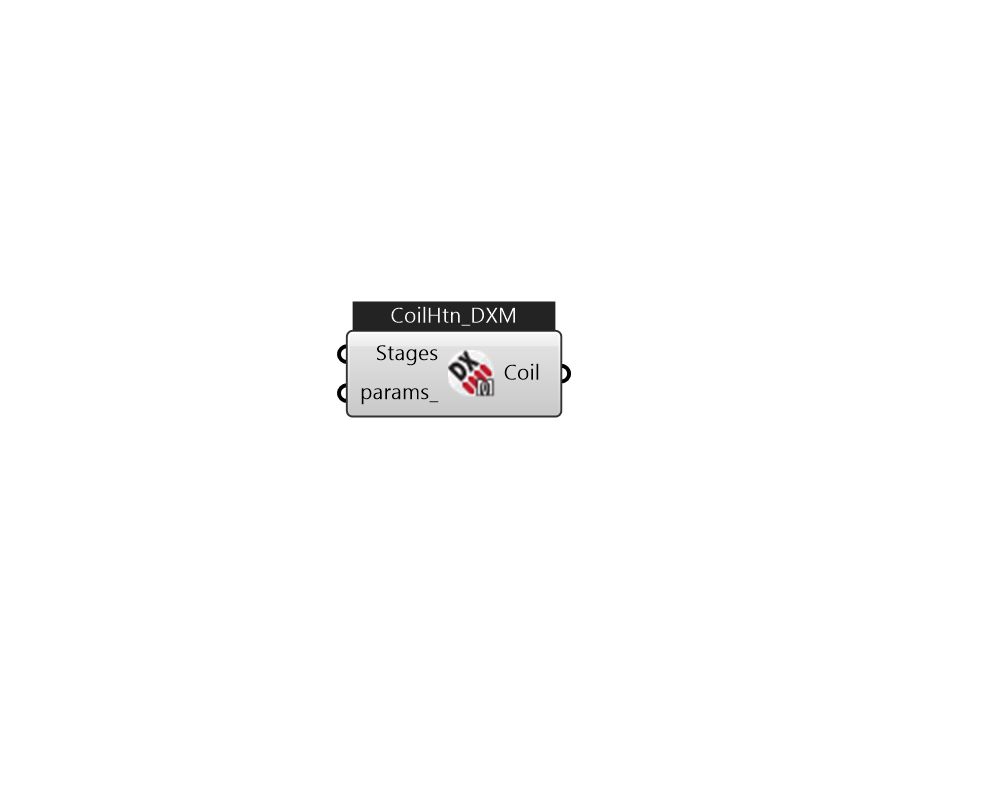

## IB_CoilHeatingDXMultiSpeed

This component models a DX heating unit with multiple discrete levels of heating capacity. Currently, this heating coil can only be referenced by a {AirLoopHVAC:UnitarySystem} or {AirLoopHVAC:UnitaryHeatPump:AirToAir:MultiSpeed} compound object. The multispeed DX heating coil can have from two to four operating speeds. When the coil operates at Speed 1 (the lowest speed), its performance is very similar to the {Coil:Heating:DX:SingleSpeed} object where the impacts of part-load ratio can be included. When the coil operates at higher speeds (above Speed 1), the linear approximation methodology is applied. The coil outputs at two consecutive speeds are linearly interpolated to meet the required heating capacity during an HVAC system timestep. When the coil performs above the lowest speed, the user can choose if they want to include part-load ratio impacts at the higher speeds. The multispeed unit is described by specifying the performance at different operating speeds. Each speed has its.... (Due to the length of content, documentation has been shown partially)  Above content copyright © 1996-2025 EnergyPlus, all contributors. All rights reserved. EnergyPlus is a trademark of the US Department of Energy. 

#### Inputs
* ##### Stages 
A list of IB_CoilHeatingDXMultiSpeedStageData 
* ##### params 
Detail settings for this HVAC object. Use Ironbug_ObjParams to set input parameters, or use Ironbug_OutputParams to set output variables. 

#### Outputs
* ##### Coil
CoilHeatingDXMultiSpeed 