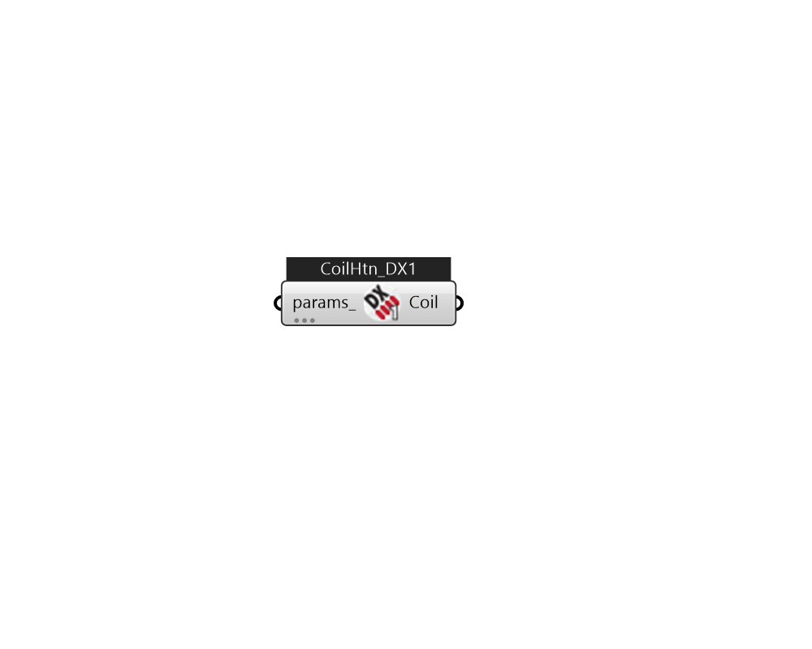

## IB_CoilHeatingDXSingleSpeed

The single speed heating DX coil model uses performance information at rated conditions along with curve fits for variations in total capacity, energy input ratio and part load fraction to determine performance at part-load conditions. The impacts of various defrost strategies (reverse cycle, resistive, timed or on-demand) are modeled based on a combination of user inputs and empirical models taken from the air-to-air heat pump algorithms in DOE-2.1E. The single speed heating DX coil input requires an availability schedule, the gross rated heating capacity, the gross rated COP and the rated air volume flow rate. The latter 3 inputs determine the coil performance at the rating point (outdoor air dry-bulb temperature of 8.33°C, outdoor air wet-bulb temperature of 6.11°C, coil entering air dry-bulb temperature of 21.11°C, coil entering air wet-bulb temperature of 15.55°C). The rated air volume flow rate should be between 0.00004027 m³/s and 0.00006041 m³/s per watt of gross rated heating.... (Due to the length of content, documentation has been shown partially)  Above content copyright © 1996-2025 EnergyPlus, all contributors. All rights reserved. EnergyPlus is a trademark of the US Department of Energy. 

#### Inputs
* ##### params 
Detail settings for this HVAC object. Use Ironbug_ObjParams to set input parameters, or use Ironbug_OutputParams to set output variables. 

#### Outputs
* ##### Coil
CoilHeatingDXSingleSpeed 