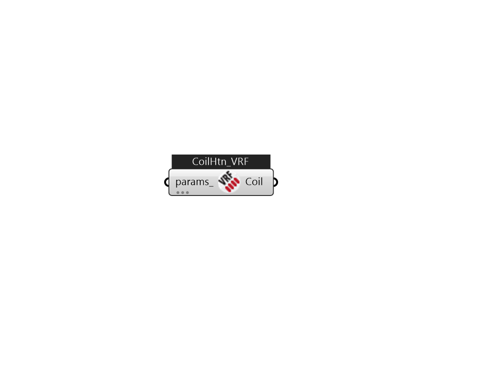

## IB_CoilHeatingDXVariableRefrigerantFlow

The variable refrigerant flow (VRF) DX heating coil model uses performance information at rated conditions along with performance curves for variations in total capacity, energy input ratio and part load fraction to determine performance at part-load conditions. The impacts of defrost operation is modeled based a combination of user inputs and empirical models taken from the air-to-air heat pump algorithms in DOE-2.1E. The VRF DX heating coil input requires an availability schedule, the gross rated heating capacity and the rated air volume flow rate. The rated air volume flow rate should be between 0.00008056 m³/s and 0.00002684 m³/s per watt of gross rated heating capacity. Two performance curves are required. The first performance curve defines the heating capacity as a function of indoor air dry-bulb and outdoor condenser entering air dry-bulb or wet-bulb temperature. The outdoor air temperature type is specified in the variable refrigerant flow air-to-air heat pump object. The se.... (Due to the length of content, documentation has been shown partially)  Above content copyright © 1996-2025 EnergyPlus, all contributors. All rights reserved. EnergyPlus is a trademark of the US Department of Energy. 

#### Inputs
* ##### params 
Detail settings for this HVAC object. Use Ironbug_ObjParams to set input parameters, or use Ironbug_OutputParams to set output variables. 

#### Outputs
* ##### Coil
Connect to Ironbug_ZoneHVACTerminalUnitVariableRefrigerantFlow_Advanced 