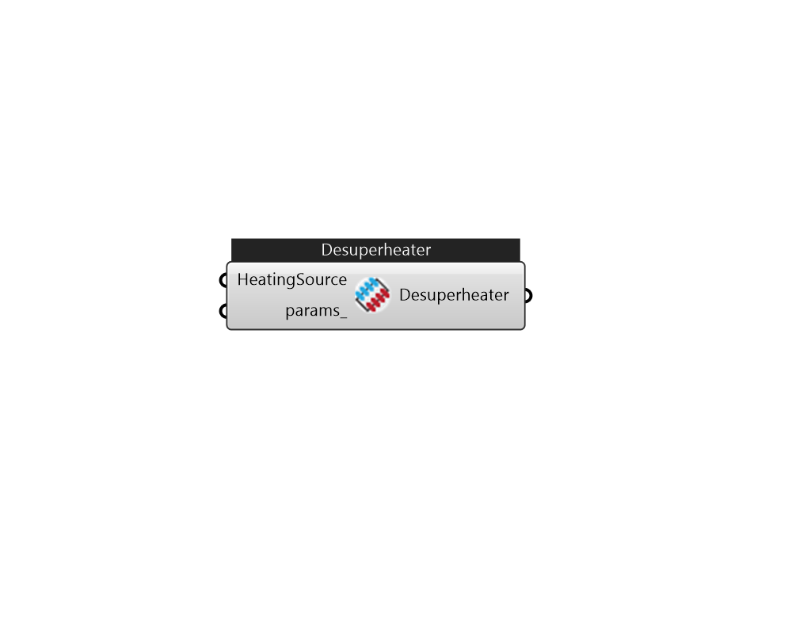

## IB_CoilHeatingDesuperheater

A simplified approach is used to determine the performance of this air heating coil. The model assumes that the heating energy provided by this coil is reclaimed from the superheated refrigerant gas leaving a compressor (i.e., a desuperheating refrigerant-to-air heating coil) and does not impact the performance of the compressor. This coil can be used in air loop simulations but can't be used by certain compound objects (e.g., {AirLoopHVAC:UnitaryHeatPump:AirToAir}, {AirLoopHVAC:UnitaryHeatPump:WaterToAir}, or {Dehumidifier:Desiccant:NoFans}) or any air distribution equipment (e.g., {AirTerminal:SingleDuct:ConstantVolume:Reheat}, {AirTerminal:SingleDuct:VAV:Reheat}, or {AirTerminal:SingleDuct:SeriesPIU:Reheat}). The desuperheater heating coil input requires a coil name, an availability schedule, and a heat reclaim recovery efficiency. The reclaim recovery efficiency determines the amount of heat available for use by this heating coil. Approximately 25-30% of the energy rejected by typ.... (Due to the length of content, documentation has been shown partially)  Above content copyright © 1996-2025 EnergyPlus, all contributors. All rights reserved. EnergyPlus is a trademark of the US Department of Energy. 

#### Inputs
* ##### HeatingSource 
Heating source, can be CoilCoolingDXSingleSpeed or CoilCoolingDXTwoSpeed 
* ##### params 
Detail settings for this HVAC object. Use Ironbug_ObjParams to set input parameters, or use Ironbug_OutputParams to set output variables. 

#### Outputs
* ##### Desuperheater
A desuperheater with a heating source (CoilCoolingDXSingleSpeed or CoilCoolingDXTwoSpeed). 