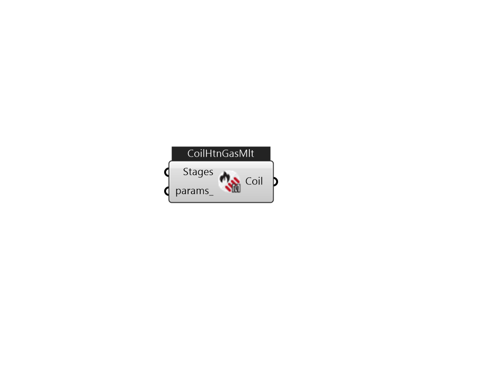

## IB_CoilHeatingGasMultiStage

The multi stage gas heating coil is a simple capacity model with a user inputted gas burner efficiencies at different stages. This coil will only have air nodes to connect it in the system. The coil can be used in the air loop simulation or in the zone equipment as a reheat coil. Depending on where it is used determines if this coil is temperature or capacity controlled. If used in the air loop simulation it will be controlled to a specified temperature scheduled from the Setpoint Manager. If it is used in zone equipment, it will be controlled from the zone thermostat by meeting the zone demand. For the time being, this coil model can only be called by the parent objects {AirLoopHVAC:UnitarySystem} or {AirLoopHVAC:UnitaryHeatPump:AirToAir:MultiSpeed}.  Above content copyright © 1996-2025 EnergyPlus, all contributors. All rights reserved. EnergyPlus is a trademark of the US Department of Energy. 

#### Inputs
* ##### Stages 
A list of IB_CoilHeatingGasMultiStageStageData 
* ##### params 
Detail settings for this HVAC object. Use Ironbug_ObjParams to set input parameters, or use Ironbug_OutputParams to set output variables. 

#### Outputs
* ##### Coil
CoilHeatingGasMultiStage 