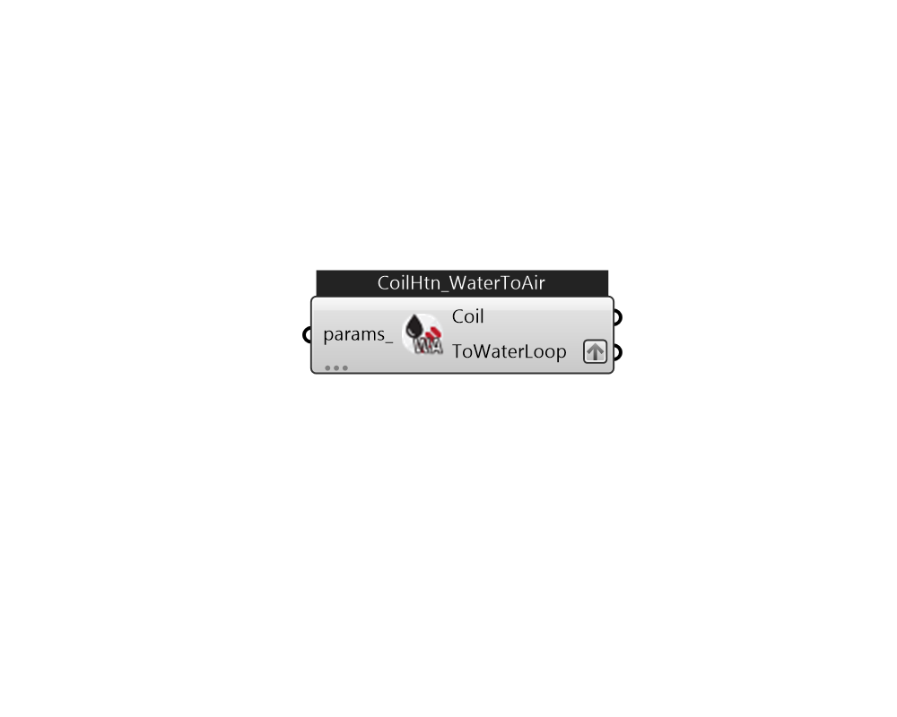

## IB_CoilHeatingWaterToAirHeatPumpEquationFit

The Water to Air Heating Equation Fit Coil is a simple curve-fit model that requires coefficients generated from the heat pump catalog data. This is an equation-fit model that resembles a black box with no usage of heat transfer equations. The performance of the heat pump is modeled using curves fitted from the catalog data.  Above content copyright © 1996-2025 EnergyPlus, all contributors. All rights reserved. EnergyPlus is a trademark of the US Department of Energy. 

#### Inputs
* ##### params 
Detail settings for this HVAC object. Use Ironbug_ObjParams to set input parameters, or use Ironbug_OutputParams to set output variables. 

#### Outputs
* ##### Coil
Connect to ZoneHVACWaterToAirHeatPump 
* ##### ToWaterLoop
Connect to hot water loop's demand side via plantBranches 