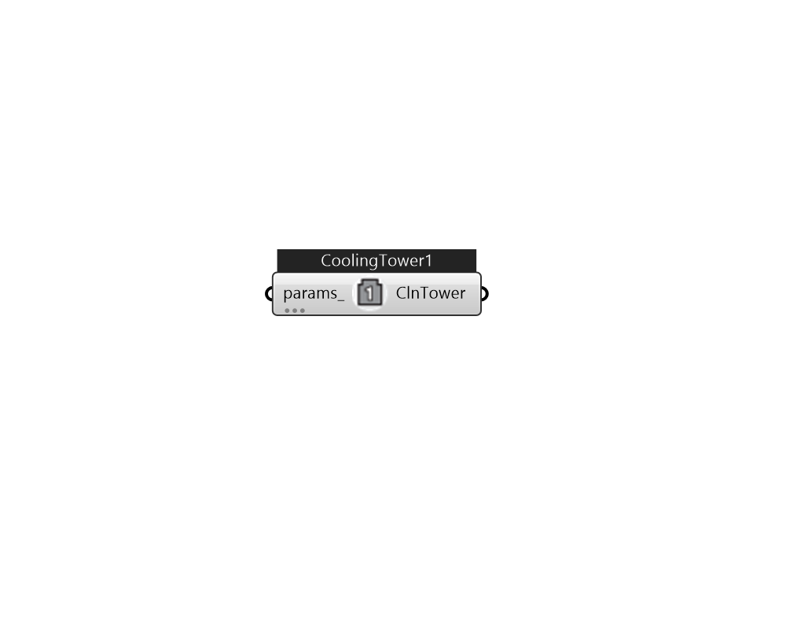

## IB_CoolingTowerSingleSpeed

Cooling towers are components that may be assigned to condenser loops. The cooling tower is modeled as a counterflow heat exchanger with a single-speed fan (induced draft configuration) based on Merkel's theory. The user must define tower performance via one of two methods: design heat transfer coefficient-area product (UA) and design water flow rate, or nominal tower capacity at a specific rating point. Regardless of which method is chosen, the design airflow rate and corresponding fan power must be specified. The model will also account for tower performance in the ``free convection'' regime, when the tower fan is off but the water pump remains on and heat transfer still occurs (albeit at a low level). If the user wants the model to account for ``free convection'', they must specify the corresponding airflow rate and heat transfer coefficient-area product (UA), or the nominal tower capacity during this mode of operation. The cooling tower seeks to maintain the temperature of the wat.... (Due to the length of content, documentation has been shown partially)  Above content copyright © 1996-2025 EnergyPlus, all contributors. All rights reserved. EnergyPlus is a trademark of the US Department of Energy. 

#### Inputs
* ##### params 
Detail settings for this HVAC object. Use Ironbug_ObjParams to set input parameters, or use Ironbug_OutputParams to set output variables. 

#### Outputs
* ##### ClnTower
CoolingTowerSingleSpeed 