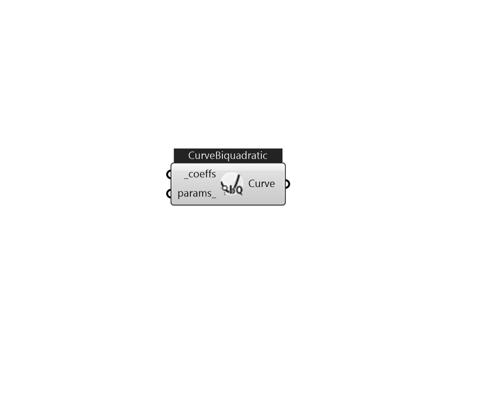

## IB_CurveBiquadratic

This curve is a function of two independent variables. Input consists of the curve name, the six coefficients, and min and max values for each of the independent variables. Optional inputs for curve minimum and maximum may be used to limit the output of the performance curve (e.g., limit extrapolation). The equation represented by the biquadratic curve is: z = {C_1} + {C_2}*x + {C_3}*{x^2} + {C_4}*y + {C_5}*{y^2} + {C_6}*xy  Above content copyright © 1996-2025 EnergyPlus, all contributors. All rights reserved. EnergyPlus is a trademark of the US Department of Energy. 

#### Inputs
* ##### coeffs [Required]
A list of coefficients for a biquadratic curve from C1 to C6. 
* ##### params 
Detail settings for this HVAC object. Use Ironbug_ObjParams to set input parameters, or use Ironbug_OutputParams to set output variables. 

#### Outputs
* ##### Curve
CurveBiquadratic 