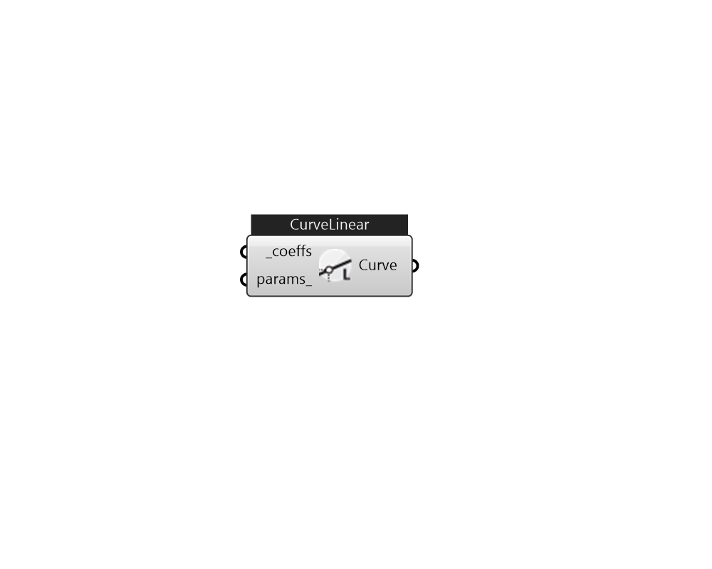

## IB_CurveLinear

Input for the linear curve consists of a curve name, the two coefficients, and the maximum and minimum valid independent variable values. Optional inputs for curve minimum and maximum may be used to limit the output of the performance curve (e.g., limit extrapolation). The equation represented by the linear curve is: y = {C_1} + {C_2}*x  Above content copyright © 1996-2025 EnergyPlus, all contributors. All rights reserved. EnergyPlus is a trademark of the US Department of Energy. 

#### Inputs
* ##### coeffs [Required]
A list of coefficients for a linear curve from C1 to C2. 
* ##### params 
Detail settings for this HVAC object. Use Ironbug_ObjParams to set input parameters, or use Ironbug_OutputParams to set output variables. 

#### Outputs
* ##### Curve
CurveLinear 