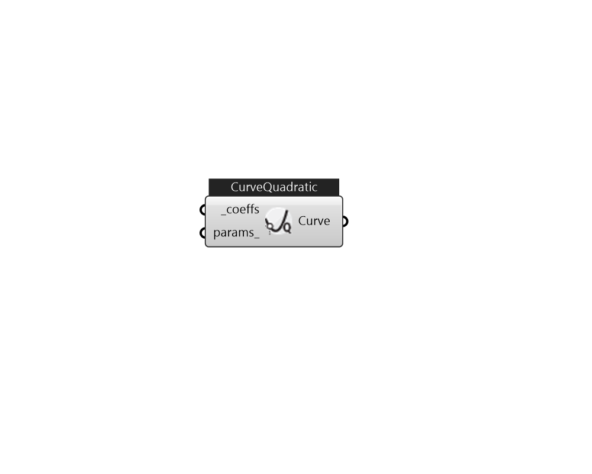

## IB_CurveQuadratic

Input for a quadratic curve consists of the curve name, the three coefficients, and the maximum and minimum valid independent variable values. Optional inputs for curve minimum and maximum may be used to limit the output of the performance curve (e.g., limit extrapolation). The equation represented by the quadratic curve is: y = {C_1} + {C_2}*x + {C_3}*{x^2}  Above content copyright © 1996-2025 EnergyPlus, all contributors. All rights reserved. EnergyPlus is a trademark of the US Department of Energy. 

#### Inputs
* ##### coeffs [Required]
A list of coefficients for a quadratic curve from C1 to C3. 
* ##### params 
Detail settings for this HVAC object. Use Ironbug_ObjParams to set input parameters, or use Ironbug_OutputParams to set output variables. 

#### Outputs
* ##### Curve
CurveQuadratic 