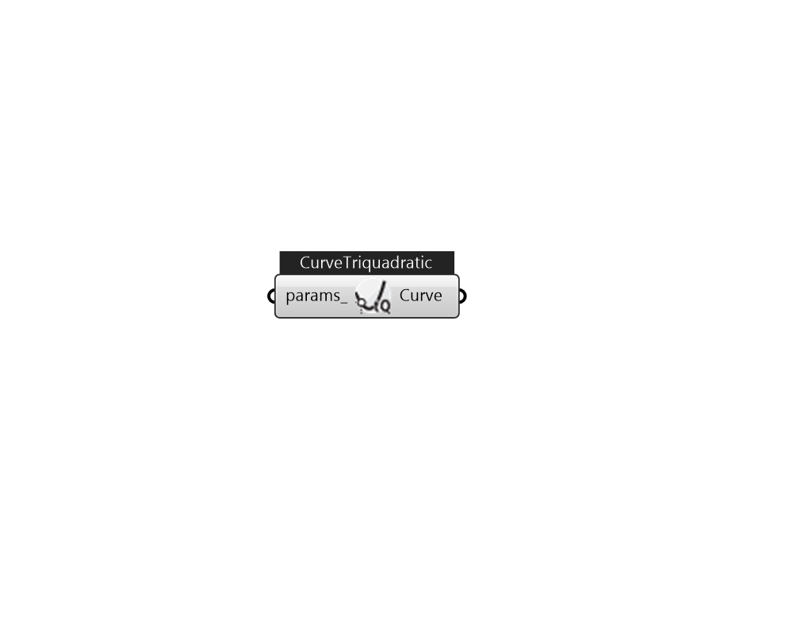

## IB_CurveTriquadratic

This curve is a 2^nd order polynomial function of three variable polynomial independent variables. Input consists of the curve name, the twenty seven coefficients, and min and max values for each of the independent variables. Optional inputs for curve minimum and maximum may be used to limit the output of the performance curve (e.g., limit extrapolation). The equation represented by the triquadratic curve: CurveValue = {A_0} + {A_1}*{x^2} + {A_2}*x + {A_3}*{y^2} + {A_4}*y + {A_5}*{z^2} + {A_6}*z + {A_7}*{x^2}{y^2} + {A_8}*xy + \\ \quad \quad \quad \quad \quad {A_9}*x{y^2} + {A₁₀}*{x^2}y + {A₁₁}*{x^2}{z^2} + {A₁₂}*xz + {A₁₃}*x{z^2} + {A₁₄}*{x^2}z + {A₁₅}*{y^2}{z^2} + \\ \quad \quad \quad \quad \quad {A₁₆}*yz + {A₁₇}*y{z^2} + {A₁₈}*{y^2}z + {A₁₉}*{x^2}{y^2}{z^2} + {A₂₀}*{x^2}{y^2}z + {A₂₁}{x^2}y{z^2} + {A₂₂}x{y^2}{z^2} + \\ \quad \quad \quad \quad \quad {A₂₃}{x^2}yz + {A₂₄}x{y^2}z + {A₂₅}xy{z^2} + {A₂₆}xyz  Above content copyright © 1996-2025 EnergyPlus, all contributors. All rights reserved. EnergyPlus is a trademark of the US Department of Energy. 

#### Inputs
* ##### params 
Detail settings for this HVAC object. Use Ironbug_ObjParams to set input parameters, or use Ironbug_OutputParams to set output variables. 

#### Outputs
* ##### Curve
CurveTriquadratic 