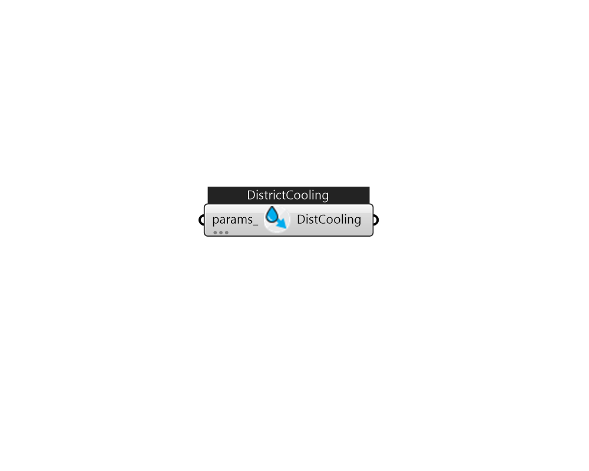

## IB_DistrictCooling

When the user is not interested in a plant simulation or there is some centralized source of chilled water, the following object can be used in the input.  Above content copyright © 1996-2025 EnergyPlus, all contributors. All rights reserved. EnergyPlus is a trademark of the US Department of Energy. 

#### Inputs
* ##### params 
Detail settings for this HVAC object. Use Ironbug_ObjParams to set input parameters, or use Ironbug_OutputParams to set output variables. 

#### Outputs
* ##### DistCooling
DistrictCooling for plant loop's supply. 