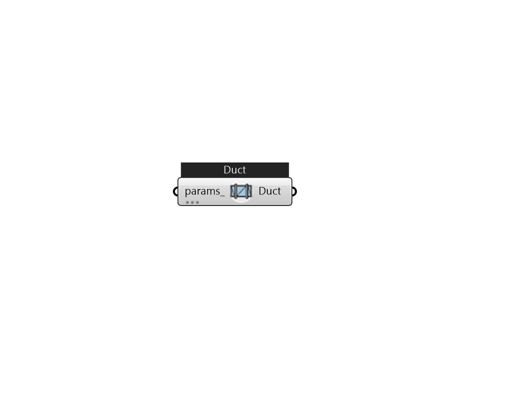

## IB_Duct

The Duct object is a component for air systems that is a direct analogue for {Pipe:Adiabatic} in the fluid loops. It is used when it is necessary (due to the HVAC system configuration) to have a branch that has no functional components. This case most often arises for a bypass branch. Since every branch must have at least one component, the Duct component is used for this situation. The duct is an adiabatic, pass-through component; all of its inlet conditions are passed through unchanged to its outlet.  Above content copyright © 1996-2025 EnergyPlus, all contributors. All rights reserved. EnergyPlus is a trademark of the US Department of Energy. 

#### Inputs
* ##### params 
Detail settings for this HVAC object. Use Ironbug_ObjParams to set input parameters, or use Ironbug_OutputParams to set output variables. 

#### Outputs
* ##### Duct
Duct 