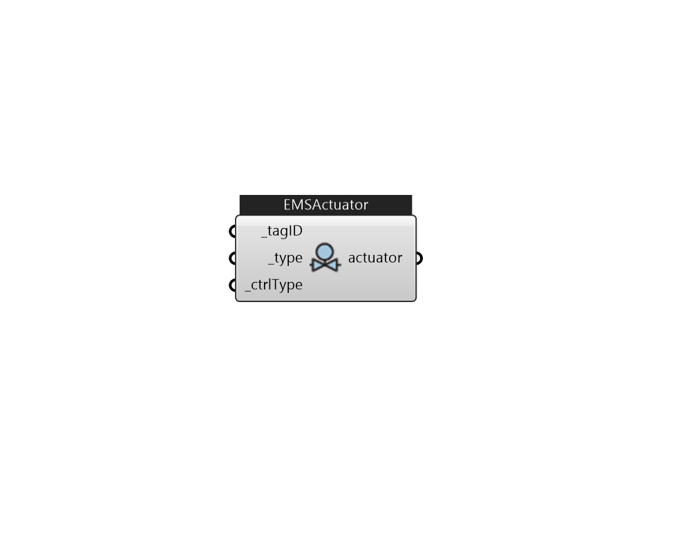

## IB_EMSActuator

Description 

#### Inputs
* ##### tagID [Required]
Assign a tag id for this actuator that can be referenced in EMS program. 
* ##### type [Required]
Actuated Component Type 
* ##### ctrlType [Required]
Actuated Component Control Type 

#### Outputs
* ##### actuator
actuator 