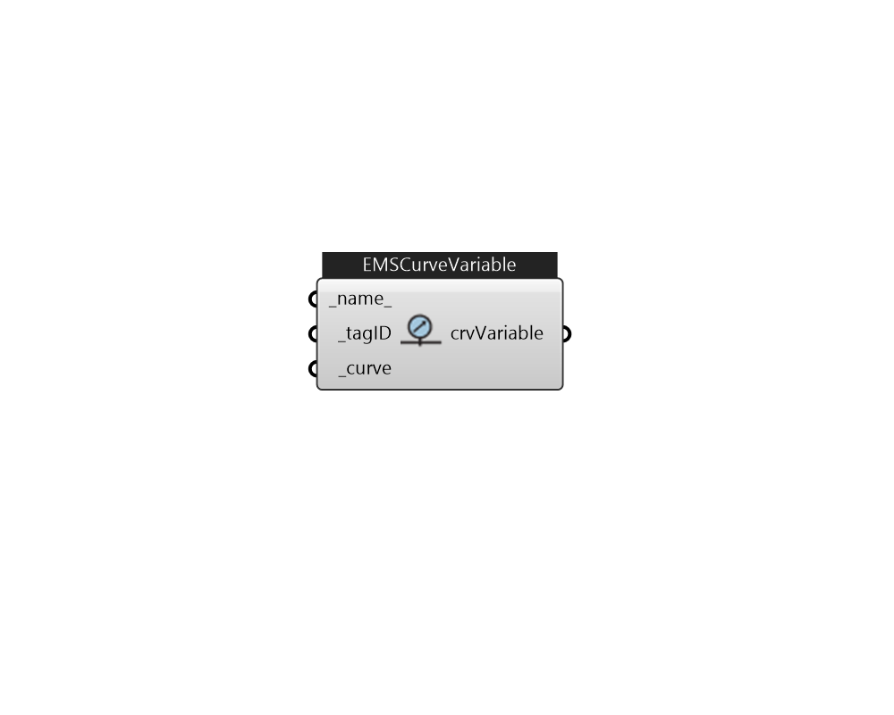

## IB_EMSCurveVariable

Description 

#### Inputs
* ##### name 
Name 
* ##### tagID [Required]
Assign a tag id for this actuator that can be referenced in EMS program. 
* ##### curve [Required]
Curve 

#### Outputs
* ##### crvVariable
CurveVariable 