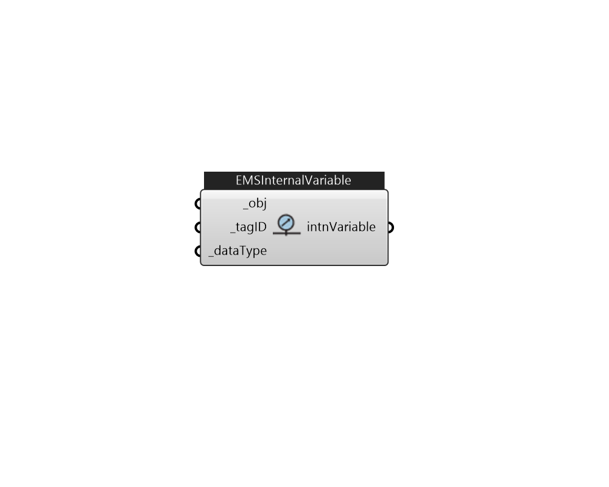

## IB_EMSInternalVariable

Description 

#### Inputs
* ##### obj [Required]
a Hvac object for getting internal variable 
* ##### tagID [Required]
Assign a tag id for this actuator that can be referenced in EMS program. 
* ##### dataType [Required]
Internal Data Type 

#### Outputs
* ##### intnVariable
InternalVariable 