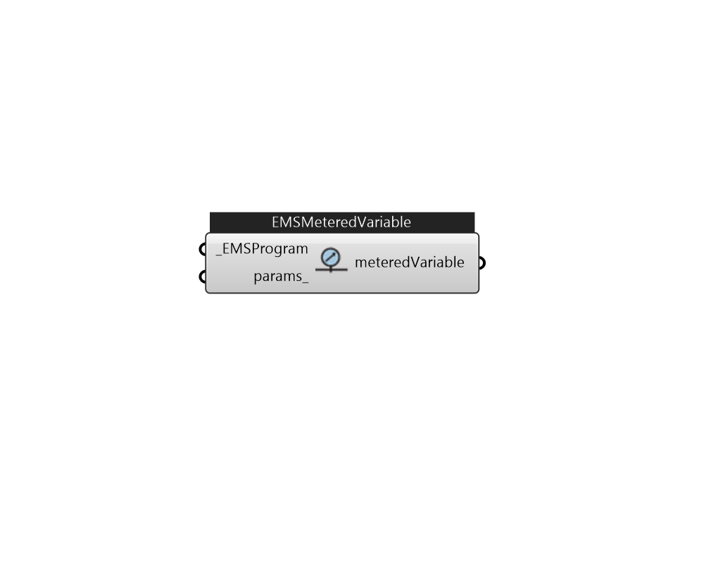

## IB_EMSMeteredOutputVariable

The EnergyManagementSystem:MeteredOutputVariable object creates a custom output variable that is mapped to an EMS variable and is also included in the metering system that EnergyPlus has for aggregating results for different resources across the model. This object is very similar to {EnergyManagementSystem:OutputVariable} with the main differences being that only summed types of data in the Erl variable and the quantity is to be added to a meter. This allows for custom output variables that also impact the results for the amount of electricity or gas consumed.  Above content copyright © 1996-2025 EnergyPlus, all contributors. All rights reserved. EnergyPlus is a trademark of the US Department of Energy. 

#### Inputs
* ##### EMSProgram [Required]
EMS program 
* ##### params 
Detail settings for this HVAC object. Use Ironbug_ObjParams to set input parameters, or use Ironbug_OutputParams to set output variables. 

#### Outputs
* ##### meteredVariable
Metered output variable 