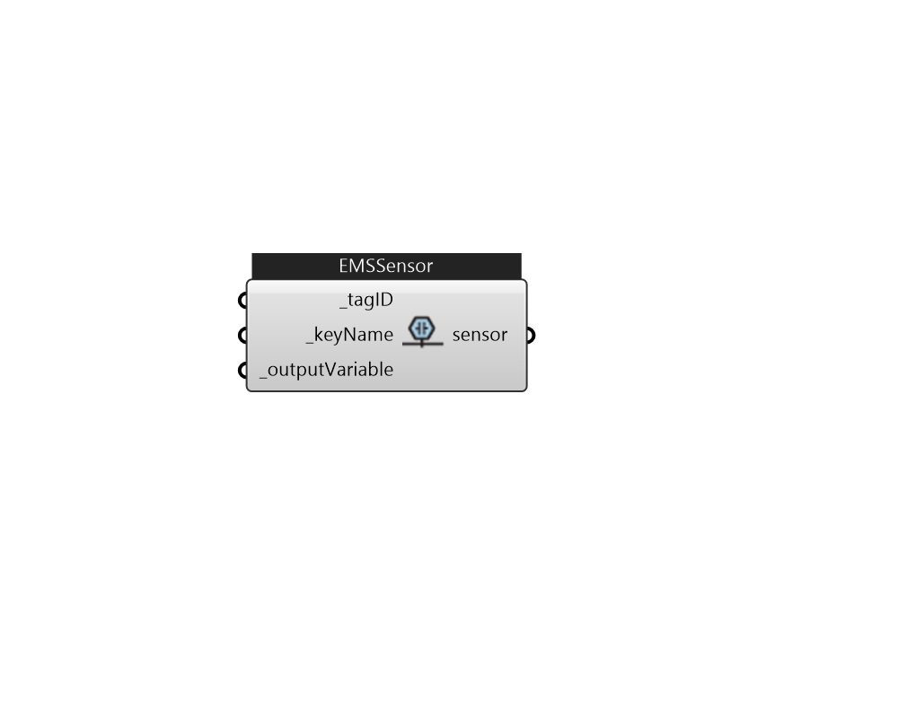

## IB_EMSSensor

Description 

#### Inputs
* ##### tagID [Required]
Assign a tag id for this actuator that can be referenced in EMS program. 
* ##### keyName [Required]
Object that to add sensor on 
* ##### outputVariable [Required]
Output Variable 

#### Outputs
* ##### sensor
sensor 