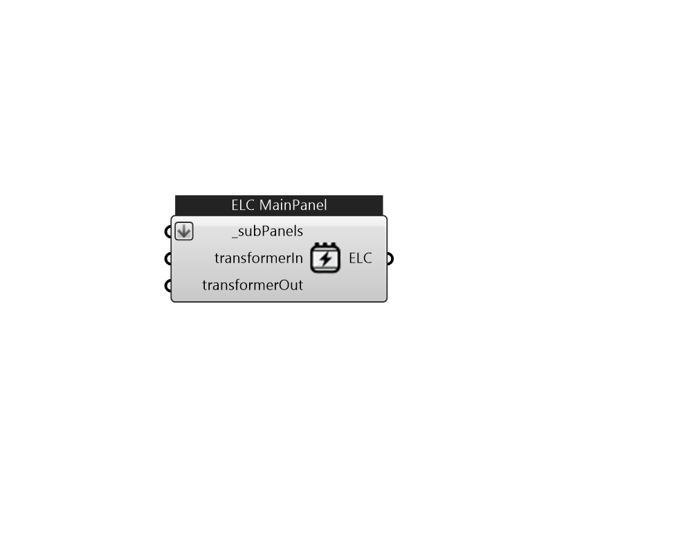

## IB_ElectricLoadCenter

The main panel of the ElectricLoadCenter 

#### Inputs
* ##### subPanels [Required]
A list of ElectricLoadCenters 
* ##### transformerIn 
An optional input for a transformer for transferring electricity from the grid to a building (as distribution transformers) when applicable 
* ##### transformerOut 
An optional input for a transformer for transferring electricity from onsite generators to the grid when applicable 

#### Outputs
* ##### ELC
ElectricLoadCenter main panel 