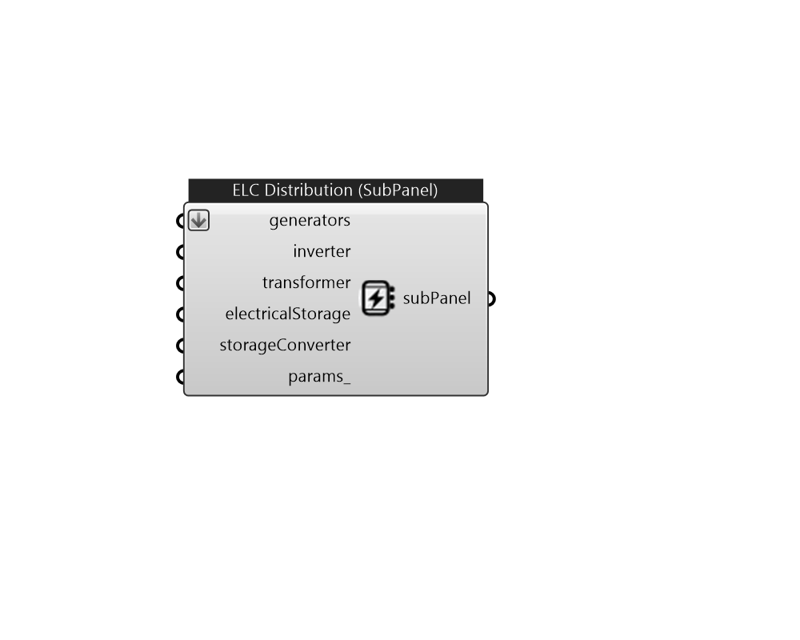

## IB_ElectricLoadCenterDistribution

ElectricLoadCenter:Distribution objects are used to include on-site electricity generators and or storage in a simulation. The electric load center dispatches both generators and storage according to operation schemes and tracks and reports the amount of electricity generated and purchased. When using on-site generators, the program provides various reports for the electricity used, generated on site, stored, exported etc. There are two separate operation schemes, one for generators and a second for storage, and they can be different. The generator operation is managed before the storage operation. Facility electrical demand tracking is done by the internal or custom meters used by EnergyPlus for reporting. The thermal demand tracking uses internal load calculations from the plant simulation. The dispatching of different generators is based on expectations based on their nominal/rated electric power output. If the current conditions are such that the generator model determines that gen.... (Due to the length of content, documentation has been shown partially)  Above content copyright © 1996-2025 EnergyPlus, all contributors. All rights reserved. EnergyPlus is a trademark of the US Department of Energy. 

#### Inputs
* ##### generators 
A list of IB_Generator 
* ##### inverter 
This field is used to identify the inverter connected to this load center (if any). This field is only used if the Electrical Buss Type is set to DirectCurrentWithInverter, DirectCurrentWithInverterDCStorage, or DirectCurrentWithInverterACStorage and should contain the user-defined name of an inverter object. There are three types of inverter models available -see {ElectricLoadCenter:Inverter:Simple}, {ElectricLoadCenter:Inverter:LookUpTable}, {ElectricLoadCenter:Inverter:FunctionOfPower}, or {ElectricLoadCenter:Inverter:PVWatts}. Enter the name of one of these types of inverter objects defined elsewhere in the input file. 
* ##### transformer 
This field is used to identify the transformer connected to this load center (if any). This field can be used for any electrical buss types. Enter the name of an {ElectricLoadCenter:Transformer} object defined elsewhere in the input file. The transformer should have use type set to LoadCenterPowerConditioning. 
* ##### electricalStorage 
This field is used to identify the electrical storage connected to this load center (if any). This field is only used if the Electrical Buss Type is set to AlternatingCurrentWithStorage, DirectCurrentWithInverterDCStorage or DirectCurrentWithInverterACStorage. Enter the name of an ElectricLoadCenter:Storage:* object defined elsewhere in the input file. 
* ##### storageConverter 
This field is the name of an {ElectricLoadCenter:Storage:Converter} object defined elsewhere in the input file that describes the performance when converting AC to DC when charging DC storage from grid supply. This field is required when using DC storage (buss type DirectCurrentWithInverterDCStorage) with grid supplied charging power (Storage Operation Scheme is set to TrackChargeDischargeSchedules or FacilityDemandLeveling.) Although some inverter devices are bidirectional a separate converter object is needed to describe AC to DC performance. 
* ##### params 
Detail settings for this HVAC object. Use Ironbug_ObjParams to set input parameters, or use Ironbug_OutputParams to set output variables. 

#### Outputs
* ##### subPanel
A distribution sub-panel of the ElectricLoadCenter main panel 